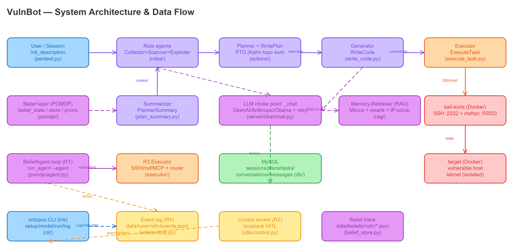
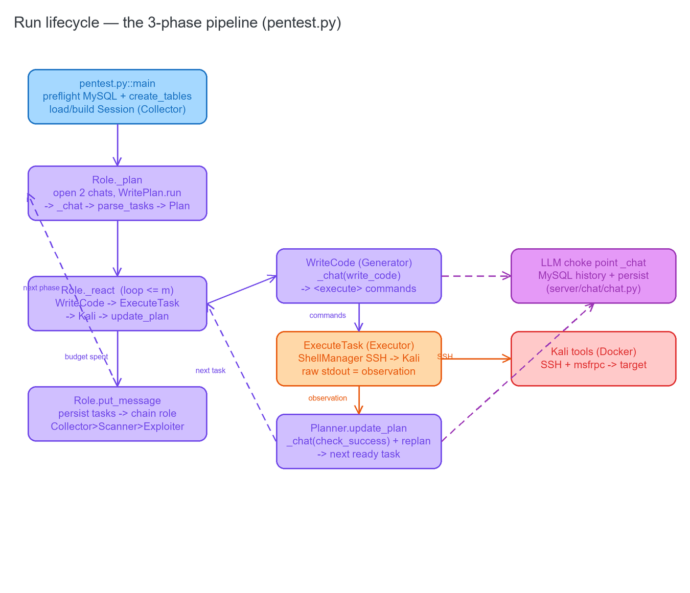
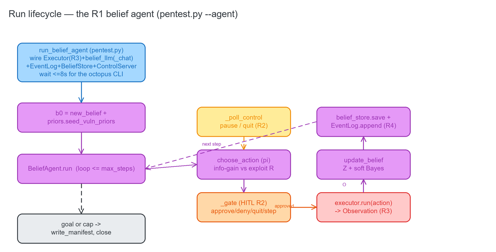

# 00 · Overview & Run Lifecycle

## What VulnBot is

VulnBot is an **autonomous penetration-testing agent**. You give it a target (an IP or a task
description); it plans an assessment, runs real tools on a Kali host, reads the output, revises its plan,
and works through recon → scanning → exploitation — driven end-to-end by a large language model, with a
human able to watch and intervene.

Two things make this fork distinctive:

1. **A multi-agent pipeline.** Work is split across three sequential **phase agents** — `Collector`
   (recon), `Scanner` (vulnerability scan), `Exploiter` (exploitation). Each phase builds a **Penetration
   Task Graph (PTG)**: a dependency graph of tasks the LLM proposes, that the agent executes one at a time
   and revises as results come in. See [`03-roles-pipeline.md`](03-roles-pipeline.md).

2. **An explicit POMDP belief-state (this thesis's contribution).** Instead of only reacting to the last
   tool output, the agent maintains a **probabilistic belief `b`** about each host's hidden state (OS,
   services, vulnerabilities, access, honeypot-likelihood). Every observation updates that belief through a
   soft Bayesian rule whose likelihoods come from the LLM; a belief-conditioned policy chooses the next
   action by trading **information gain** against **exploit value**. See [`01-belief-pomdp.md`](01-belief-pomdp.md).

The fork also hardens the system into a fully interactive tool across four requirements:

| Req | What it delivers | Where |
|-----|------------------|-------|
| **R1** | The full POMDP loop as a standalone control loop (`BeliefAgent`). | [`01-belief-pomdp.md`](01-belief-pomdp.md) |
| **R2** | Human-in-the-loop: approve/deny high-impact actions, pause/resume/step/quit — over a loopback socket. | [`05-cli-frontend.md`](05-cli-frontend.md) |
| **R3** | One `Executor.run(action) → Observation` over pluggable channels (SSH, msfrpc, flag-gated MCP). | [`02-executor.md`](02-executor.md) |
| **R4** | JSON is the on-disk source of truth (`events.jsonl`); the CLI renders it, never raw JSON. | [`04-llm-persistence.md`](04-llm-persistence.md) + [`05`](05-cli-frontend.md) |

## The whole system at a glance

**Source:** [`../ARCHITECTURE.md`](../ARCHITECTURE.md)

## The POMDP in one table

The POMDP tuple ⟨S, A, O, T, Z, R, b, γ, π⟩ maps directly to code (full detail in
[`../POMDP_INTEGRATION.md`](../POMDP_INTEGRATION.md)):

| Symbol | Meaning | Code |
|--------|---------|------|
| **S** | hidden true config of a host (never observed by the agent) | lab ground truth only |
| **b** | factored-JSON belief over S | [`pomdp/belief_state.py`](../../pomdp/belief_state.py)`::new_belief`; persisted by [`belief_store.py`](../../pomdp/belief_store.py) |
| **A** | recon / exploit / lateral / privesc | [`pomdp/belief_state.py`](../../pomdp/belief_state.py)`::Action` |
| **O** | raw tool output | [`pomdp/observation.py`](../../pomdp/observation.py)`::Observation.raw` |
| **Z** | P(O \| hypothesis) — the observation model | LLM likelihoods inside `update_belief` (code normalizes) |
| **T** | which belief factor an action bears on | `_target_factor` inside `update_belief` |
| **R** | goal value − cost − detection risk | `score_action` fed by [`pomdp/priors.py`](../../pomdp/priors.py) |
| **π** | belief → action | `choose_action` (info-gain vs exploit-value argmax) |
| **γ** | discount factor | `GAMMA` |

---

## Run lifecycle — the legacy 3-phase pipeline

**Source:** [`pentest.py`](../../pentest.py) · [`roles/role.py`](../../roles/role.py)

`python pentest.py -m 5 --description "..."` (or octopus `/run <target>`). The pipeline is a
plan → react → hand-off loop repeated for each of the three phases:

Step by step:

1. **Entry & preflight** (`pentest.py::main`). Parses flags, checks MySQL is reachable (`db_reachable`),
   creates tables if missing (`create_tables`), and builds/loads a `Session` (`initialize_session` /
   `preload_session`). The session starts in the `Collector` role.
2. **Role dispatch.** `main` looks up the role class by `session.current_role_name`
   (`{Collection: Collector, Scanning: Scanner, Exploitation: Exploiter}`) and calls `role.run(session)`.
3. **Plan** (`Role._plan`). Opens **two** LLM conversations (planning + reasoning), asks the LLM (via
   `_chat`) for an initial 1–5 task plan as `<json>`, parses it into a `Plan` + `Task`s (`WritePlan.run` →
   `parse_tasks`), and persists the plan (`add_plan_to_db`). For phases after the first, the **Summarizer**
   (`PlannerSummary`) condenses the previous phase into the plan's context.
4. **React loop** (`Role._react`, up to `max_interactions`). For each task: the **Generator** (`WriteCode`)
   turns it into `<execute>` shell commands; the **Executor** (`ExecuteTask` → `ShellManager`/`RemoteShell`)
   runs them on Kali over one shared SSH session (raw stdout is the observation); then the **Planner**
   scores the result (`check_success` LLM call), revises the PTG (`WritePlan.update` + `merge_tasks`), and
   returns the next topologically-ready task (`Plan.get_sorted_tasks`).
5. **Hand off** (`Role.put_message`). When the phase's task budget is exhausted, the finished tasks are
   persisted and the role **chains to the next**: `Collector` → `Scanner` → `Exploiter` (terminal).
6. **Save & teardown.** The session is saved (`save_session`); the shared SSH shell is closed.

Every LLM call funnels through [`server/chat/chat.py::_chat`](../../server/chat/chat.py) (see
[`04-llm-persistence.md`](04-llm-persistence.md)).

---

## Run lifecycle — the R1 belief-first agent (`--agent`)

**Source:** [`pentest.py`](../../pentest.py)`::run_belief_agent` · [`pomdp/agent.py`](../../pomdp/agent.py)

`python pentest.py --agent -m 20 --description "..."` (or octopus `/run --agent <target>`) diverts to
`run_belief_agent`, which drives the **standalone `BeliefAgent` loop** instead of the 3-phase pipeline:

1. **Wire up.** Build an R3 `Executor` (SSH always; msfrpc if importable; MCP only if `VULNBOT_MCP` is on),
   a `str→str` belief LLM over `_chat`, a per-run `EventLog` (`data/runs/<id>/events.jsonl`) and
   `BeliefStore` (`data/beliefs/<id>/`), and — for R2 — open a loopback `ControlServer` and wait briefly for
   the octopus CLI to connect.
2. **b0.** Seed a factored belief with conventional priors + CVSS/exploit-maturity vuln priors (`new_belief`
   + `priors.seed_vuln_priors`).
3. **Loop until goal or step-cap** (`BeliefAgent.run`): **π** picks the next action (`choose_action`); the
   **HITL gate** (R2) blocks a high-impact action on the human's reply; **execute** (R3) returns a
   normalized `Observation`; **update** (Z + soft Bayes) moves the posterior (a failed exploit *softens* the
   belief, never zeroes it); **persist** the belief + append the events.
4. **Manifest & teardown.** At run end a `manifest.json` links `events.jsonl` ↔ the belief trace; the
   executor and control socket close.

The octopus CLI, connected over the three lanes, renders the live view, prompts approvals, and — via `/log`
— tails and renders `events.jsonl` per record type (never raw JSON).

---

## Glossary

- **PTG (Penetration Task Graph)** — the `Plan` + its `Task`s with integer dependencies, topologically
  sorted (Kahn) so tasks run only after their prerequisites succeed. Diagram in
  [`03-roles-pipeline.md`](03-roles-pipeline.md).
- **Belief `b`** — a factored JSON dict, per host, of probability distributions over OS / services / vulns /
  access / honeypot-likelihood. Never contains the hidden true state S. Diagram in
  [`01-belief-pomdp.md`](01-belief-pomdp.md).
- **Observation `O`** — the normalized result of running one action; `Observation.raw` is the raw tool
  output the belief updater reasons over.
- **Z (observation model)** — P(observation | hypothesis). Supplied by the LLM as *likelihoods*; the code
  does the Bayesian normalization.
- **`##OCTO##` marker** — a compact `##OCTO## <kind>|k=v` line the Python side prints to stdout for the CLI's
  live view (lane 1).
- **The three lanes** — (1) `##OCTO##` stdout markers, (2) `events.jsonl` on disk, (3) the loopback control
  socket. Diagram in [`05-cli-frontend.md`](05-cli-frontend.md).
- **Channel** — one execution transport to Kali (SSH, msfrpc, or flag-gated MCP) behind the R3 `Executor`.
- **Choke point** — [`server/chat/chat.py::_chat`](../../server/chat/chat.py), the single function every LLM
  call passes through.
