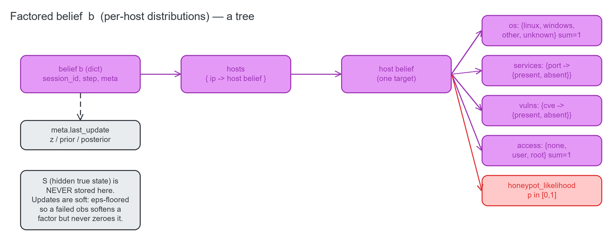
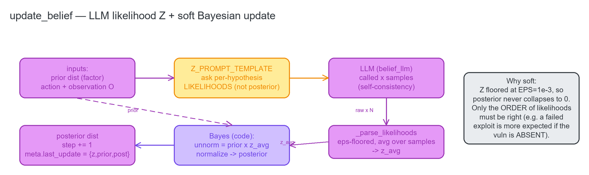
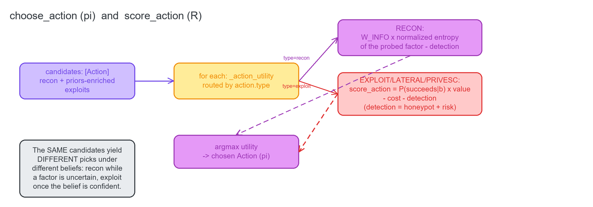

# 01 · The Belief Layer (POMDP) — `pomdp/`

This is the thesis's core contribution: an **explicit POMDP belief-state** bolted onto an LLM pentest
agent. Instead of only reacting to the last tool output, the agent maintains a probabilistic **belief `b`**
about each host's hidden configuration and updates it, action after action, through a soft Bayesian rule
whose likelihoods are supplied by the LLM. A belief-conditioned policy then chooses the next action by
trading information gain against exploit value.

Every module here is **stdlib-only**, so it imports without the heavy RAG/ML stack, and the layer **never
reads or branches on the hidden true state S** — it acts on the belief only. The whole loop is shown here;
each sub-part gets its own diagram in the sections below.


---

## 1.1 The factored belief `b` — a per-host tree

**Source:** [`pomdp/belief_state.py`](../../pomdp/belief_state.py) (`new_belief` / `new_host_prior`)

The belief is a nested JSON dict. The root carries a `session_id`, a `step` counter, and a `meta` block;
under `hosts`, each target maps to its own **factored** sub-belief — independent probability distributions
over the host's OS, its services, its vulnerabilities, its access level, and how likely it is to be a
honeypot. "Factored" means each factor is updated independently, which keeps the belief small and the
Bayesian update local to whichever factor an observation bears on.



The shape, per host:

```
{ "os": {linux, windows, other, unknown → p},   # sums to 1
  "services": {port → {present, absent}},        # each pair sums to 1
  "vulns":    {cve  → {present, absent}},         # seeded from CVSS/maturity
  "access":   {none, user, root},                 # sums to 1
  "honeypot_likelihood": p }                       # P(host is a honeypot)
```

---

## 1.2 `pomdp/belief_state.py` — belief data + the math (Updater, π, R)

**Source:** [`pomdp/belief_state.py`](../../pomdp/belief_state.py)

The heart of the layer: the belief constructors, the three POMDP operations (Updater, policy, reward), and
the module constants. Key constants: `GAMMA = 0.95` (the discount γ), `EPS = 1e-3` (the likelihood floor
that keeps updates *soft*), `OS_CLASSES` / `ACCESS_LEVELS` (the hypothesis sets), `Z_PROMPT_TEMPLATE` (the
prompt that asks the LLM for per-hypothesis likelihoods), `DEFAULT_VALUE`, and the policy weights
`W_INFO` / `W_EXPLOIT`.

### Belief construction (the b0 priors)

**`z_samples(default=1) -> int`** — Reads the `OCTOPUS_Z_SAMPLES` environment variable (clamped to ≥1) and
returns the self-consistency sample count. This is the **single source of truth** for how many times the
Updater samples the LLM per update, so the standalone `BeliefAgent` and the legacy Role updater agree.
`samples > 1` averages the likelihood estimate to reduce noise; the default 1 means one LLM call.

**`class ActionType`** — Namespaced string constants `RECON` / `EXPLOIT` / `LATERAL` / `PRIVESC`. Kept as
plain strings (not an enum) so they serialize trivially into events and JSON.

**`class Action` (dataclass)** — A candidate action the policy chooses among. Carries `name`, `type`,
`host`, `tool`, and `params` (how the executor runs it), plus the three reward inputs `value` / `cost` /
`detection_risk` that `score_action` consumes. `to_dict()` serializes it for events. Actions are cheap
value objects — the policy generates many and scores them.

**`new_host_prior(host, vuln_priors=None, service_priors=None) -> dict`** — Returns the **conventional b0
prior** for one host: a *uniform* "I don't know" distribution over OS (maximal ignorance), no access yet, a
low honeypot prior (0.05), and any seeded vuln/service priors. These are conventional priors, not measured
data — Bayes washes out imperfect priors after a few observations.

**`new_belief(session_id, hosts=None, vuln_priors=None) -> dict`** — Assembles a fresh belief b0 for a run:
the root scaffold plus one `new_host_prior` per known host. `hosts` may be empty at the start of recon (hosts
are added as they're discovered); `vuln_priors` maps host → `{vuln_id: P(present)}`, typically filled by
`priors.seed_vuln_priors`.

**`add_host(belief, host, vuln_priors=None) -> dict`** — Returns a **copy** of the belief with a
newly-discovered host inserted at its b0 prior. Idempotent — re-adding an existing host is a no-op. Never
mutates the input (all belief ops are copy-on-write so the caller can keep the prior belief for logging).

### The Belief Updater (Z + soft Bayes)

The Updater is the answer to the classic POMDP problem that the observation model Z (the tables of
P(observation | hidden state)) is "unobtainable" for real systems. Here the LLM supplies the **likelihoods**
and the *code* does the Bayesian normalization — only the relative order of the likelihoods has to be right.



**`update_belief(belief, action, observation, llm=None, samples=1) -> dict`** — The soft Bayesian update.
It decides which factor the observation bears on (via `_target_factor`), formats `Z_PROMPT_TEMPLATE` with
the action, the hypotheses, and the raw observation, and calls `llm` (a `str → str` callable) `samples`
times to get per-hypothesis likelihoods Z. It averages Z across the samples (self-consistency), then
computes `posterior ∝ prior × Z`, floors every likelihood at `EPS`, and normalizes. The floor is what makes
the update **soft**: a failed exploit moves belief mass (e.g. 0.70 → ~0.50) but can never collapse a
hypothesis to exactly 0. It returns a **new** belief with `step` incremented and `meta.last_update`
populated with `{z, prior, posterior, host, factor, key, action}` — the record the R4 event log reads. It
raises `ValueError` if no `llm` is supplied. **It never reads S.**

### The reward R and the policy π

`choose_action` is the policy π; it maximizes a per-action utility that treats recon and exploitation
differently — recon is worth the *uncertainty it can resolve*, exploitation is worth its *expected reward R*.



**`score_action(action, belief) -> float`** — The reward **R** = P(succeeds | b)·value − cost − detection.
The success weight is the belief that the target vuln is present (recon always "succeeds" in yielding an
observation, so its weight is 1). Detection risk combines the target host's `honeypot_likelihood` with the
action's own `detection_risk`, so a honeypot-suspected host is penalized. `value` / `cost` / `detection_risk`
come from `pomdp/priors.py`. Never reads S.

**`choose_action(candidates, belief) -> Action`** — The policy **π**: `argmax` of `_action_utility` over the
candidates. For a **recon** action the utility is `W_INFO × (normalized entropy of the probed factor) −
detection` — a recon is worth more when the belief it would sharpen is uncertain. For an **exploit / lateral
/ privesc** action the utility is `score_action` (R). The crucial property: the *same* candidate set yields
*different* choices under *different* beliefs — recon while a factor is uncertain, exploit once the belief is
confident. Raises `ValueError` on an empty candidate list.

**`run_agent(*args, **kwargs)`** — The historical top-level entry point. It is now a thin **lazy** delegator
to `pomdp.agent.run_agent` (the lazy import inside the function breaks the `pomdp.agent ↔ belief_state`
import cycle). The belief math above is untouched by this — only the old `NotImplementedError` stub body
changed.

### Internal helpers

`_default_dist(hyps)` (a uniform prior over a hypothesis set, used the first time a factor is seen),
`_target_factor(action, belief)` (**the T of the tuple** — decides which factor an action+observation
updates: exploit/lateral/privesc → the target vuln, recon → a probed service or the OS distribution),
`_get_dist` / `_set_dist` / `_peek_dist` (read/write a factor's distribution, with `_peek_dist` read-only),
`_parse_likelihoods(text, hyps)` (robustly extract `{hypothesis: likelihood}` from an LLM reply, ε-floored,
tolerant of surrounding prose), `_entropy(dist)` (Shannon entropy, 0 = certain), and
`_action_utility(action, belief)` (the per-action utility π maximizes).

---

## 1.3 `pomdp/observation.py` — the unified `Observation` (the O of the tuple)

**Source:** [`pomdp/observation.py`](../../pomdp/observation.py)

The ONE normalized result type that crosses three boundaries: every R3 executor channel returns an
`Observation`; the R1 Updater reads `obs.raw` as the observation O; and the R4 event log appends
`obs.to_dict()` verbatim as the `observation` record. Stdlib-only, so it imports without the ML stack.

**`new_action_id() -> str`** — A short (12-hex) correlation id that ties an Action → its Observation → its
event-log records together across the three lanes.

**`class Observation` (dataclass)** — The normalized result of running one action. `action_id` (the
correlation id), `channel` (which adapter produced it), `action_type`, `host`, `tool`, `raw` (**= O**, the
raw tool output the Updater reads — never empty even for a failed call, which carries its stderr here),
`structured` (a parsed dict when the channel returns structure, e.g. msfrpc), `success` (True/False/None),
`exit_code`, `duration_ms`, `error`, and `ts`.

**`Observation.to_dict()`** — A JSON-ready dict; this *is* the body of an `observation` event record (R4).

**`Observation.from_dict(d)`** — Rebuild from `to_dict()` output, ignoring unknown keys so the schema can
grow without breaking old logs (forward-compatible).

**`Observation.failure(action_id, channel, action_type, error, host=None, tool=None)`** — Build a normalized
**failure** Observation. Crucially it mirrors `error` into `raw`, so the Belief Updater still receives a
(softening) observation instead of an empty string when a channel fails.

---

## 1.4 `pomdp/priors.py` — offline reward priors (R inputs + b0 vuln priors)

**Source:** [`pomdp/priors.py`](../../pomdp/priors.py)

A stdlib-only, **offline-by-design** source of the reward inputs and the b0 vuln priors, derived from public
CVSS + exploit-maturity signals. No network call and no eager `rag/` import — nothing here touches the
attack path. These are conventional priors, not measured data; Bayes washes them out. Constants:
`MATURITY_WEIGHT` (exploit maturity → weight in [0,1]), `BUILTIN_CATALOG` (a committed seed catalog keyed by
CVE, populated with the metasploitable2 lab's well-known services), and `_BASE_DETECTION` (per-action-class
detection floors — recon is quieter than exploiting).

**`load_catalog(path=None) -> dict`** — The built-in catalog overlaid with an optional git-ignored
`PENTEST_ROOT/data/priors/exploit_catalog.json`. A missing or garbled override file falls back to the
built-in catalog and never raises — priors are advisory.

**`merge_catalog(base, extra) -> dict`** — A per-CVE shallow overlay of `extra` onto `base`. This is the hook
a future live RAG/CVE enrichment step would call to extend the catalog without code changes.

**`vuln_prior_present(cvss, maturity) -> float`** — The b0 prior P(vuln present) from CVSS + maturity,
computed as `0.5·(cvss/10) + 0.5·maturity_weight` and clamped to [0.05, 0.95] (so a seeded vuln is never
certain either way).

**`reward_params(cvss, maturity, action_type="exploit") -> dict`** — Returns `{value, cost, detection_risk}`
for an action. A high-CVSS, mature exploit is worth more (`value`), an immature exploit is costlier to land
(`cost`) and noisier (`detection_risk`). All three are clamped to [0,1].

**`enrich_action(action, catalog=None) -> Action`** — Returns a **copy** of the action with its reward inputs
filled from the catalog (looked up by the action's target CVE). For an unknown vuln it applies a conservative
per-type default so R is still well-defined. Only fills fields the caller left at their defaults — it never
clobbers explicit values, and never mutates the input.

**`seed_vuln_priors(vuln_ids, catalog=None) -> dict`** — Maps a list of vuln ids → `{id: P(present)}` for
`new_belief(vuln_priors=…)` b0 seeding.

Internal: `_clamp`, `_maturity_w`, `_catalog_path`, `_vuln_id_of` (best-effort CVE id extraction from an
action's params or name).

---

## 1.5 `pomdp/belief_store.py` — the per-run belief trace

**Source:** [`pomdp/belief_store.py`](../../pomdp/belief_store.py)

A stdlib-only per-run JSON store under `PENTEST_ROOT/data/beliefs/<run_id>/` — one file per step — so a run
produces an inspectable **belief trace** (used by the thesis's calibration/export work and the CLI's
`/belief`).

**`class BeliefStore(root=None)`** — The store. `root` defaults to `PENTEST_ROOT/data/beliefs`.

**`BeliefStore.save(belief, run_id=None) -> Path`** — Persists the belief as `step_<n>.json` (n from
`belief['step']`) and also as `latest.json`. `run_id` defaults to `belief['session_id']`; raises if neither
is available. Returns the step file's path.

**`BeliefStore.load_latest(run_id)`** / **`load_step(run_id, step)`** — Return the most recent belief, or a
specific step's belief, or `None` if nothing is saved.

**`BeliefStore.steps(run_id) -> list[int]`** — The sorted list of persisted step numbers.

**`BeliefStore.history(run_id) -> list[dict]`** — The full belief trace, all steps in order — the artifact a
calibration run reads to compare belief-vs-truth.

Internal: `run_dir`, `_step_path`, `_latest_path`, `_default_root`, `_safe_id`.

---

## 1.6 `pomdp/agent.py` — the R1 standalone `BeliefAgent` loop

**Source:** [`pomdp/agent.py`](../../pomdp/agent.py)

The integrator that ties everything together into the belief-first control loop shown at the top of this
page: b0 → `choose_action` (π) → HITL gate (R2) → `executor.run` (R3) → `update_belief` (Z + soft Bayes) →
`belief_store.save` → events (R4), until a goal predicate or the step cap. The belief math is *imported*,
never re-implemented; every side channel is best-effort so a failure there never breaks a run.

Module-level: the callable type aliases `BeliefLLM` / `CandidateFn` / `GoalFn` / `ApproveFn`; `_HIGH_IMPACT`
(the action types gated by default); `_ROOT_BELIEF_STOP` / `_ROOT_MARKERS` (the default goal signals);
`_resolve_samples` (explicit arg else `z_samples()`); `_default_goal` (stop when a host is believed rooted or
the last observation shows a root marker); and `run_agent(executor, belief_llm, session_id, **kw)` (the
convenience wrapper the `belief_state.run_agent` delegator calls, which splits ctor vs run kwargs).

**`BeliefAgent.__init__(executor, belief_llm, store=None, events=None, approve=None, control=None,
step=False, max_steps=20, samples=None, goal_fn=None)`** — Construct the loop. `belief_llm` (required) is the
`str → str` callable the Updater uses for Z. `approve` is the simple bool gate used by tests; `control` is a
`utils.control.ControlServer` for the real socket HITL; `step=True` gates *every* action, not just
high-impact ones.

**`BeliefAgent.run(session_id, hosts=None, vuln_ids=None, candidates_fn=None, target=None) -> dict`** — The
loop. Seeds b0 (conventional priors + seeded vuln priors), saves it, then each step: `_poll_control` (handle
a between-steps pause/quit), generate candidates, `choose_action` (π), `_gate` (R2), `_execute` (R3),
`_update` (Z+Bayes), `_save`, emit the R4 events, and check the goal. On exit it writes the run manifest.
Returns the final belief. **Never raises out of the loop body** — a bad generator, a broken gate, an executor
hiccup, a Z failure, or a dead event sink are all caught and the loop continues to the step cap.

**`BeliefAgent._default_candidates(belief) -> list[Action]`** — The default candidate generator: one recon
action per known host plus one priors-enriched exploit per vuln the belief already carries. Overridable via
`candidates_fn` for a deployment that mines recon output for real services/CVEs and names MSF modules.

**`BeliefAgent._needs_approval(action) -> bool`** — True when the action is high-impact
(exploit/lateral/privesc) or step-mode is on.

**`BeliefAgent._gate(action, step) -> str`** — Returns `"approve"` / `"deny"` / `"quit"`. Precedence: the
bool `approve` callback wins if set (tests); otherwise the control socket gates high-impact/step actions by
sending an `approval_request` and blocking on the reply. No connected client, or a non-gated action, ⇒
`"approve"` (auto) — a missing CLI never blocks a run.

**`BeliefAgent._await_decision() -> str`** — Blocks on control replies until the human approves/denies/quits.
`step` runs this one action then arms step-through; `pause`/`resume` are acknowledged and keep waiting; a
dropped client (recv → None) ⇒ auto-approve.

**`BeliefAgent._poll_control() -> str | None`** — Between steps, a *non-blocking* check for pause/quit/step; a
`pause` blocks here until `resume`/`quit`. Returns `"quit"` to stop the run, else `None`.

**`BeliefAgent._execute(action) -> Observation`** — Runs the action through the executor, guarded so that even
if the executor somehow raises, a normalized failure Observation is synthesized and the loop lives on.

**`BeliefAgent._update(belief, action, obs) -> dict`** — Calls `update_belief(belief, action, obs.raw, llm,
samples)`, guarded: a Z/update failure keeps the prior belief and emits an `error` event instead of crashing.

**`BeliefAgent._save(belief, session_id)`** — Best-effort `belief_store.save`.

**`BeliefAgent._write_manifest(session_id, belief)`** — At run end, asks the EventLog to write `manifest.json`
linking `events.jsonl` ↔ the belief trace (only if the sink supports it).

**`BeliefAgent._score(action, belief)`** — The reward R of the chosen action (belief before the update), for
the `score` event.

**`BeliefAgent._emit(type, **fields)` / `_emit_observation(step, obs)` / `_emit_belief_events(belief)`** —
Append the R4 event set (best-effort): `run_start`, per-step `action_selected` + `score`, gated
`approval_request`/`approval_result`, `observation` (the full `to_dict()`), `belief_update` (prior+posterior),
`llm_likelihoods` (Z + belief before/after + the action — a self-contained evidence record),
`decision`/`error`/`run_end`. The belief events fire only when the update actually advanced the step, so a
failed update never re-emits stale records.

**`BeliefAgent._ctrl_connected` / `_ctrl_send` / `_ctrl_recv`** — Guarded, duck-typed shims over the control
socket so a missing or broken control never breaks the run.

### What the tests lock (`tests/test_belief.py`, `tests/test_agent.py`)

A failed observation **softens** (never zeroes); belief keeps mass on multiple hypotheses; Z is **not** the
identity; **self-consistency** (`samples>1` averages Z, lowers variance); the **T-effect** (the same
observation under an exploit vs a recon moves different factors); and the full **HITL** semantics
(approve/deny/quit/step/pause/resume, disconnected-never-blocks).
