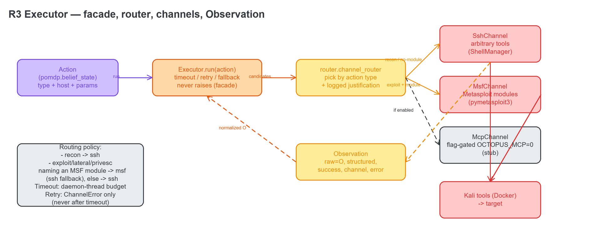
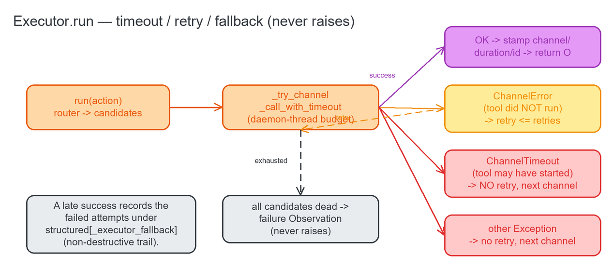
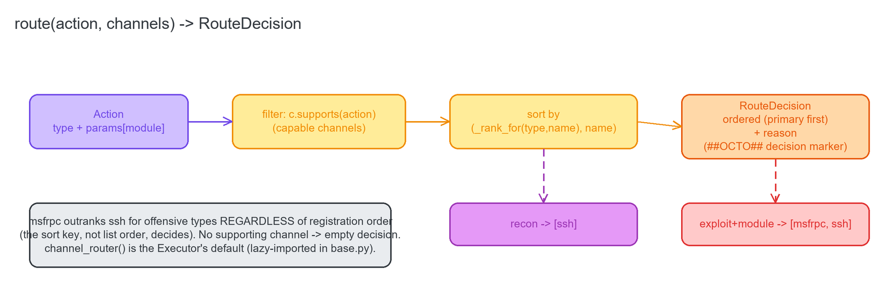

# 02 · The R3 Multi-Channel Executor — `executor/`

One `Executor.run(action) → Observation` facade over pluggable **channels** (SSH, msfrpc, flag-gated MCP), a
**router** that picks the right channel per action type, and per-channel **timeout / retry / fallback** — so
the belief loop always receives a normalized `Observation`, whatever the transport underneath. The layer is
stdlib-only (channels lazy-import their heavy deps), holds **no offensive code** (the tools live in Kali),
and **never raises** into its caller.

The higher-level narrative is [`../EXECUTOR.md`](../EXECUTOR.md); this page is the function-by-function
reference.

---

## 2.1 `executor/base.py` — the facade + the `Channel` contract

**Source:** [`executor/base.py`](../../executor/base.py)

The facade and the adapter interface every channel implements. Two exception types encode *why* a channel
failed, which drives the retry policy.

**`class ChannelError(Exception)`** — Raised when a channel is unusable *before* the tool ran (connect fail,
auth fail, RPC down). Because the tool did **not** execute, retrying the same channel is safe.

**`class ChannelTimeout(ChannelError)`** — Raised when a channel exceeds its time budget. It subclasses
`ChannelError` but is treated differently: the tool **may already have started**, so a timed-out call is
**never** auto-retried (a non-idempotent exploit must not fire twice).

**`class Channel(abc.ABC)`** — One execution transport. Concrete adapters implement `name` (stamped onto
`Observation.channel`), `supports(action) -> bool`, `run(action, action_id) -> Observation`, and an optional
`close()`. The contract: a channel MUST normalize its result into an `Observation` and MUST NOT let an
ordinary tool failure escape as a bare exception — it raises `ChannelError` only when the channel *itself*
is unusable, so the facade can fall back.

**`Router` (type)** — `Callable[[Action, Sequence[Channel]], List[Channel]]`. A plug point: given an action
and the registered channels, return the ordered list to try (primary first, then fallbacks).

**`_default_router(action, channels)`** — The fallback router: every channel that `supports(action)`, in
registration order. Used only if the real policy router can't be imported.

**`_note_fallback(obs, errors)`** — When a call only succeeds after a retry or fallback, this records the
preceding failures under the reserved `structured["_executor_fallback"]` key. Non-destructive — the winning
Observation's `raw` / `error` / `success` are untouched — so the R4 log shows the trail.

**`_make_default_router() -> Router`** — The Executor's default: it lazily imports
`executor.router.channel_router` (the lazy import avoids a circular dependency, since the router imports this
module) and falls back to `_default_router` on any import failure, so the facade always runs.

**`class Executor(channels=None, router=None, timeout_s=None, retries=0, events=None)`** — The facade. Holds
the registered channels, the router, the robustness config (`timeout_s`, `retries`), and an optional R4
`events` sink. Pass the *same* `EventLog` instance the agent uses so the event `seq` stays a single monotonic
sequence across route decisions and belief events.

**`Executor.register(channel) -> Executor`** — Append a channel (chainable).

**`Executor.run(action, action_id=None) -> Observation`** — The one entry point. It asks the router for the
ordered candidates, tries each via `_try_channel`, and returns the first non-raising Observation — stamping
`channel` / `duration_ms` / `action_id` and recording the route decision as an event. If every candidate is
unusable it returns a normalized **failure** Observation. It **never raises** into the belief loop.

**`Executor._emit_decision(aid, action, candidates, obs, errors)`** — Appends a `decision(kind=route)` event
to the sink: the candidate order, the channel that produced the O, whether it succeeded, the retry/fallback
`attempts` trail, and the duration. Best-effort — a dead sink never breaks a run.

**`Executor._try_channel(ch, action, aid, errors) -> Observation | None`** — Runs one channel with the
timeout budget and safe retries, returning a stamped Observation on success or `None` if the channel is
unusable. A plain `ChannelError` is retried on the same channel up to `retries` times; a `ChannelTimeout`
falls through with no retry; any other exception (a channel bug) also falls through with no retry.

**`Executor._call_with_timeout(ch, action, aid) -> Observation`** — Runs `ch.run` under the per-attempt
budget. With no budget it calls directly; with a budget it runs the call in a daemon worker thread and
`join`s for `timeout_s`, raising `ChannelTimeout` on overrun (the stuck daemon thread is abandoned — Python
can't kill arbitrary blocking I/O, so this is best-effort). Exceptions from `ch.run` are re-raised in the
caller thread so the handlers above see them.

**`Executor.close()`** — Best-effort teardown of every channel.

### The robustness state machine

In one paragraph: **timeout** runs each attempt in a daemon thread joined to the budget; an overrun →
`ChannelTimeout`. **retry** is safety-first — a plain `ChannelError` (tool didn't run) is retried on the same
channel; a `ChannelTimeout` (tool may have started) is never retried; a channel bug is never retried. On
exhaustion the facade **falls back** to the next capable channel; all-dead still returns a **failure**
`Observation`, never an exception. A late success records the earlier failures in `_executor_fallback`.

---

## 2.2 `executor/router.py` — the channel-selection policy

**Source:** [`executor/router.py`](../../executor/router.py)

Given an action and the channels, decide the ordered list to try and log *why*.

**`class RouteDecision` (dataclass)** — The result of a routing decision: `ordered` (the candidate channels,
primary first) and `reason` (a one-line justification). The `primary` property returns the first channel or
`None`.

**`_rank_for(action, name) -> int`** — The ranking key. For offensive action types (exploit/lateral/privesc)
it ranks `{msfrpc: 0, ssh: 1}`; for recon it ranks `{ssh: 0, msfrpc: 1}`; an unknown channel gets 99. Lower =
tried first.

**`route(action, channels) -> RouteDecision`** — Filters to the channels that `supports(action)`, sorts them
by `(_rank_for(type, name), name)`, and builds the reason (module-named → msfrpc / no-module → ssh / recon →
ssh, with a `; fallback: …` suffix when there's more than one candidate). Because the sort key — not the list
order — decides, **msfrpc outranks ssh for offensive types regardless of registration order**. No supporting
channel → an empty decision with an explanatory reason.

**`channel_router(emit=True) -> Router`** — Wraps `route(...)` into the `Router` the Executor uses by default.
It computes the decision, best-effort mirrors a `##OCTO## decision|kind=route` marker (for the live view /
event log), and returns `decision.ordered`. Routing stays pure — a dead emit path never breaks a run.

**Policy in one line:** recon → SSH; exploit/lateral/privesc **naming an MSF module** → msfrpc first with SSH
fallback; exploit/etc. with no module → SSH.

---

## 2.3 `executor/ssh_channel.py` — Channel A (arbitrary tools)

**Source:** [`executor/ssh_channel.py`](../../executor/ssh_channel.py)

**`class SshChannel(shell_provider=None)`** — `name="ssh"`. Runs the action's shell command(s) on Kali via
the reused `ShellManager` / `RemoteShell` singleton and normalizes raw stdout into an `Observation`.
`shell_provider` is injectable for tests; the real `ShellManager` is lazy-imported so importing this module
needs neither paramiko nor a live host.

**`SshChannel.supports(action)`** — True for any action carrying a shell command — recon, and the SSH-fallback
path for offensive actions with no MSF module.

**`SshChannel.run(action, action_id) -> Observation`** — A missing command → a failure Observation; an
unusable or failed session → `ChannelError` so the Executor falls back. On success, raw stdout becomes
`Observation.raw` (the O the Updater reads).

**`SshChannel.close()`** — Release the held shell.

---

## 2.4 `executor/msf_channel.py` — Channel B (Metasploit over msfrpc)

**Source:** [`executor/msf_channel.py`](../../executor/msf_channel.py)

**`class MsfChannel(client_provider=None)`** — `name="msfrpc"`. Drives a Metasploit module over
`pymetasploit3` and normalizes the **structured** RPC result into `Observation.structured` (with `raw` set to
an `Action:/Observation:` summary the Updater can read). Driving Metasploit over RPC is cleaner than
screen-scraping msfconsole over SSH. `client_provider` is injectable for tests; `pymetasploit3` and the
connection params (`.env`-sourced) are lazy.

**`MsfChannel._module_path(action)` (static)** — Returns the MSF module path the action names
(`params['module']` wins over `tool`), or `None`. Only a real `prefix/rest` MSF shape counts, so a bare tool
like `nmap` never gets misrouted here.

**`MsfChannel.supports(action)`** — True only for exploit/lateral/privesc actions that actually name an MSF
module.

**`MsfChannel._get_client()`** — Lazily builds (or injects) the `MsfRpcClient`; an unreachable or
misconfigured msfrpcd → `ChannelError` (fallback).

**`MsfChannel.run(action, action_id) -> Observation`** — Splits the module path, builds the options (RHOSTS
defaulted to `action.host`), runs `mod.execute(payload=…)`, and wraps the structured result. No module → a
failure Observation; a mid-run exec failure → `ChannelError`. `success` is `False` only on an explicit error
in the result — otherwise it's left `None` for the Updater's Z to reason over.

**`MsfChannel.close()`** — Drops the RPC client handle (no explicit logout — other steps may share the
session).

---

## 2.5 `executor/mcp_channel.py` — Channel C (flag-gated MCP, OFF by default)

**Source:** [`executor/mcp_channel.py`](../../executor/mcp_channel.py)

An optional MCP tool bridge that is **disabled by default** and strictly additive — SSH + msfrpc do
everything without it, so MCP is never a dependency.

**`_env_truthy(name, default="0")`** — Read an env flag as truthy (`1/true/yes/on`).

**`class McpChannel(client_provider=None, verifier=None)`** — `name="mcp"`. Injectable `client_provider` (runs
the tool) and `verifier` (confirms the server + version).

**`McpChannel.is_enabled()` (static)** — True only when `OCTOPUS_MCP` is truthy. Default **off**.

**`McpChannel._mcp_tool(action)` (static)** — The MCP tool the action names (`params['mcp_tool']` or a
`mcp:<tool>` prefix on `tool`), or `None`. A bare tool never matches.

**`McpChannel.supports(action)`** — Disabled ⇒ `False` for every action, so the router never routes here (a
pure no-op). Enabled ⇒ True only for actions naming an MCP tool.

**`McpChannel._verify()`** — Confirms the configured server + version (`OCTOPUS_MCP_SERVER` +
`OCTOPUS_MCP_VERSION`, or an injected verifier) before any call; a miss raises `ChannelError` → fallback, so
enabling the flag can never *break* a run.

**`McpChannel.run(action, action_id) -> Observation`** — Disabled → failure O; no MCP tool → failure O;
otherwise verify, then — with no real transport wired (the deliberate stub) and no `client_provider` — raise
`ChannelError` → fallback.

**`McpChannel._run_tool(action, action_id, tool)`** — The extension point for a real transport (exercised by
tests via an injected client): normalizes `call_tool` results into an `Observation`.

**`McpChannel._get_client()` / `close()`** — Build / drop the injected client (guarded).

> Verified by `tests/test_executor.py` (26 tests, fakes only — no real Kali/msfrpcd/MCP).
