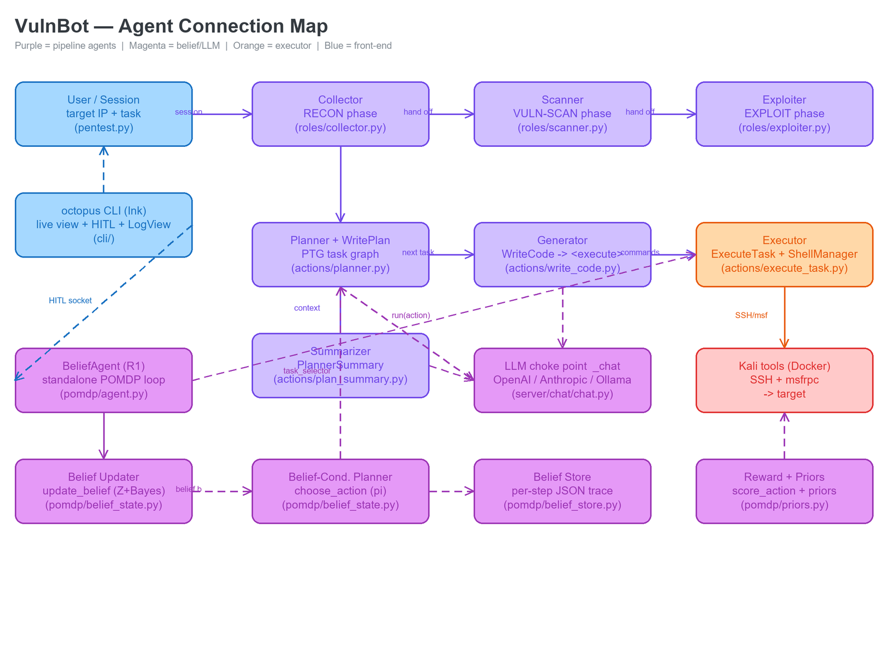
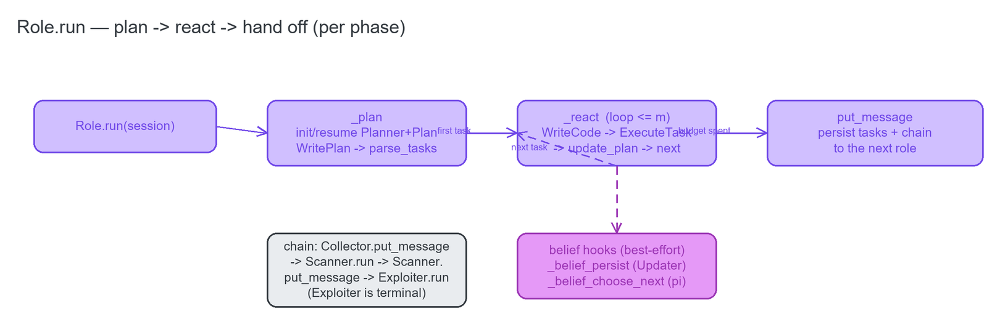
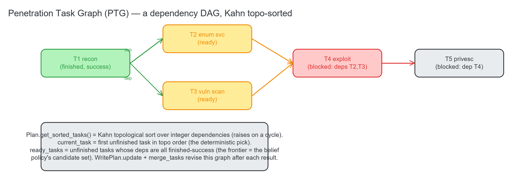

# 03 · The 3-Phase Pipeline Agents — `roles/`, `actions/`, `prompts/`

The legacy multi-agent pipeline: three **phase agents** (Collector → Scanner → Exploiter), each running a
plan → react → hand-off lifecycle built from the shared **action** classes (Planner, Generator, Executor,
Summarizer) and the **prompt** bank. This is the baseline that stays runnable; the R1 belief loop
([`01-belief-pomdp.md`](01-belief-pomdp.md)) is the alternative driver selected by `--agent`.

---

## 3.1 `roles/` — the phase agents

### `roles/role.py` — the `Role` base loop

**Source:** [`roles/role.py`](../../roles/role.py)

The base loop is a state machine: `_plan` once, then `_react` repeatedly, then `put_message` to hand off.

**`class Role(BaseModel)`** — The base for one pentest phase. Holds `name` / `goal` / `tools` / `prompt`, a
`Planner`, a `PlannerSummary`, two chat-session ids (planning + reasoning), and `max_interactions`. Every
phase agent is a thin subclass that only sets its goal, tools, and prompt.

**`Role.run(session)`** — The phase entry point. Runs `_plan`, then loops `_react` until the interaction cap
or no next task; emits `phase` / `plan` / `phase_done` markers along the way; finally calls `put_message` to
hand off. This is the outer loop of one phase.

**`Role._plan(session) -> next_task`** — Initializes or resumes the `Planner` + `Plan`. It either resumes an
existing plan (`get_planner_by_id`), or runs the phase's init prompts through `_chat`, persists a new `Plan`
(`add_plan_to_db`), sets the belief task-selector, and returns `Planner.plan()`. On an init failure it sets
`plan_error` and returns `None`.

**`Role._react(next_task) -> next_task`** — One react step: emit a `step` marker, run `WriteCode` (the
Generator), store the resulting command on `current_task.code`, update the belief from the observation,
summarize long output via `_chat(summary_result)` when it exceeds a threshold, then call
`Planner.update_plan(result)` to judge success and return the next task.

**`Role.get_summary(history_planner_ids) -> str`** — Builds a `PlannerSummary` over the prior phases' plan
ids and returns the LLM-condensed cross-phase context string that seeds the next phase's plan.

**`Role.put_message(message)`** — Persists `current_plan.tasks` (`add_task_to_plan`), guarded against a null
plan. Subclasses **override** this to chain to the next role (below).

**`Role._emit_tasks()`** — Streams the current PTG as `task` progress markers, which the octopus CLI renders
as the live todo checklist.

**Belief hooks (best-effort, delegate into `pomdp/`).** These wire the belief layer into the *legacy* loop:
`_belief_run_id`, `_belief_init(session)`, `_belief_llm(prompt)` (a `str→str` wrapper over `_chat` for Z,
honoring `z_samples()`), `_task_to_action_for(task)` / `_task_to_action()` (map a PTG task → an `Action`,
inferring the type from the instruction text), `_belief_choose_next(ready_tasks)` (let the belief policy pick
among dependency-ready tasks), `_belief_persist(observation)` (the Updater — runs the observation through
`update_belief` and saves), and the CLI markers `_emit_decision(action)` / `_emit_belief(b)`. Every one is
wrapped so a belief failure can never break a pentest run; `VULNBOT_BELIEF_POLICY=0` disables belief-driven
task selection (the ablation toggle).

### `roles/collector.py` — `Collector(Role)`

**Source:** [`roles/collector.py`](../../roles/collector.py)

**`class Collector(Role)`** — The reconnaissance phase (`name="Information Collection"`); tools =
Nmap/Curl/Wget/Whois/Dnsenum/Amass/…; `prompt=CollectorPrompt`. Its `put_message` is the **chaining edge to
the next agent**: after persisting tasks it flips `message.current_role_name` to `Scanning`, records the plan
id in `history_planner_ids`, clears `current_planner_id`, and calls `Scanner(...).run(message)`.

### `roles/scanner.py` — `Scanner(Role)`

**Source:** [`roles/scanner.py`](../../roles/scanner.py)

**`class Scanner(Role)`** — The vulnerability-scanning phase (`name="Vulnerability Scanner"`); tools =
Nikto/Dirb/WPScan/Sqlmap/Wapiti/Nmap-NSE/…; `prompt=ScannerPrompt`. Its `put_message` chains to
`Exploiter(...).run(message)`.

### `roles/exploiter.py` — `Exploiter(Role)`

**Source:** [`roles/exploiter.py`](../../roles/exploiter.py)

**`class Exploiter(Role)`** — The exploitation phase (`name="Vulnerability Exploiter"`); tools =
Hydra/Sqlmap/Metasploit/Netcat/Impacket/Mimikatz/…; `prompt=ExploiterPrompt`. It is **terminal** — it
inherits the base `put_message` (no further chaining).

---

## 3.2 `actions/` — the shared workers

### `actions/planner.py` — the Planner (plan/replan state machine)

**Source:** [`actions/planner.py`](../../actions/planner.py)

**`class Planner(BaseModel)`** — Owns `current_plan` (a `Plan`) + `init_description`, plus an optional belief
`task_selector`. It is the plan/replan state machine that produces the next task each react step.

**`Planner.plan() -> next_task`** — If a current task already exists, returns its details; otherwise runs
`WritePlan.run` → `parse_tasks` to build the task graph (nulling the plan on a JSON failure), then returns
`next_task_details()`.

**`Planner.update_plan(result) -> next_task`** — Scores the observation via `_chat(check_success)`, flips the
task's status (`update_task_status`), calls `WritePlan.update` with the success/fail lists, folds the revised
plan back in with `merge_tasks`, and returns the next task (or `None` if empty).

**`Planner.next_task_details() -> str`** — Picks `current_task` (belief-selected among `ready_tasks` when
there's more than one), sets `current_task_sequence`, and asks `_chat(next_task_details)` (RAG-augmented) to
expand the chosen task into actionable command detail.

**`Planner.update_task_status(plan_id, task_sequence, is_finished, is_success, result) -> Task`** — Mutates
the matching in-memory `Task`'s finished/success/result fields.

### `actions/write_plan.py` — the PTG builder

**Source:** [`actions/write_plan.py`](../../actions/write_plan.py)

This module turns the LLM's `<json>` plan into the **Penetration Task Graph** — the dependency DAG the whole
pipeline walks.

**`class WritePlan(BaseModel)`** — The LLM plan writer, bound to a `plan_chat_id`.

**`WritePlan.run(init_description) -> str`** — Calls `_chat(write_plan)` (RAG on the description) and extracts
the `<json>…</json>` block; returns `None` on `**ERROR**` or empty output.

**`WritePlan.update(task_result, success_task, fail_task, init_description) -> str`** — Calls
`_chat(update_plan)` to revise the plan JSON after a task, given the success/fail task lists and the last
result; extracts the `<json>` block.

**`parse_tasks(response, current_plan) -> Plan`** — json-loads the plan, builds `Task`s via
`import_tasks_from_json`, and sets `current_plan.tasks`.

**`preprocess_json_string(json_str) -> str`** — Escapes invalid `\@` / `\!` sequences the LLM sometimes emits,
before `json.loads`.

**`merge_tasks(response, current_plan) -> Plan`** — Preprocesses + json-loads a revised plan and merges it
with the already-completed tasks (`merge_tasks_from_json`).

**`import_tasks_from_json(plan_id, tasks_json) -> list[Task]`** — Maps LLM task dicts → `Task`s, resolving
`dependent_task_ids` into dependency index lists.

**`merge_tasks_from_json(plan_id, new_tasks_json, old_tasks) -> list[Task]`** — Preserves finished-success
tasks, re-sequences, and reindexes dependencies when merging a revised plan (so completed work is never
re-done).

### `actions/write_code.py` — the Generator

**Source:** [`actions/write_code.py`](../../actions/write_code.py)

**`class WriteCode(BaseModel)`** — Turns a next-task description into an executed command (fields `next_task`,
`action`). `run() -> ExecuteResult` calls `_chat(write_code)` to generate `<execute>`-wrapped commands, then
hands off to `ExecuteTask(...).run()`.

### `actions/execute_task.py` — the Executor (mode branch)

**Source:** [`actions/execute_task.py`](../../actions/execute_task.py)

**`class ExecuteResult(BaseModel)`** — The `{context, response}` carrier for an executed task's command
context + textual observation.

**`class ExecuteTask(BaseModel)`** — Executes commands for a task (`action`, `instruction`, `code`).
`parse_response() -> list[str]` regex-extracts commands from `<execute>…</execute>` blocks. `run() ->
ExecuteResult` dispatches by `Configs.basic_config.mode`: **Auto** → `shell_operation`; **SemiAuto** → shell
for a `Shell` action, else a manual prompt; **Manual** → a manual prompt. `shell_operation() -> str` runs the
parsed commands over the shared SSH shell, handling sudo/password prompts, SMB/FTP interactive prompts, and
Ctrl+C recovery, accumulating an `Action/Observation` transcript.

### `actions/shell_manager.py` — the singleton SSH session

**Source:** [`actions/shell_manager.py`](../../actions/shell_manager.py)

**`class ShellManager`** — Holds one paramiko SSH client + a `RemoteShell`, shared across all three phases so
they operate in the same shell session. `get_instance()` is the lazy singleton accessor; `get_shell()`
returns the shell (connecting on first use); `_connect()` opens the SSH connection to the configured Kali
host, preferring key auth when a key file is present, else password; `close()` tears both down.

### `actions/remote_shell.py` — command execution + output cleaning

**Source:** [`actions/remote_shell.py`](../../actions/remote_shell.py)

**`class SSHOutputHandler`** — Static output helpers: `decode_output(data)` (multi-encoding decode with a
replacement fallback) and `receive_data(shell, timeout)` (read until a shell prompt or interactive marker is
detected, or timeout, with Ctrl+C on timeout).

**`class RemoteShell(shell, timeout=120)`** — Command execution over one paramiko channel; it **blocks**
`apt`/`apt-get`. `_setup_shell` suppresses login banners/MOTD; `_check_forbidden_commands` rejects forbidden
commands; `execute_cmd(cmd)` sends the command, collects the output, and applies the `dirb`/`msfconsole`
cleaners; `_handle_normal_execution` auto-answers yes/no prompts.

**`clean_dirb_output(output)` / `clean_msfconsole_output(output)`** — Strip ANSI codes + noise from those
tools' verbose output.

### `actions/run_code.py` — local (non-SSH) runner

**Source:** [`actions/run_code.py`](../../actions/run_code.py)

**`class RunCode(BaseModel)`** — A pexpect-based **local** command runner (`execute_cmd`,
`run_cmd_with_timeout`). Currently referenced only in commented-out code — the live path runs on Kali over
SSH.

### `actions/plan_summary.py` — the Summarizer

**Source:** [`actions/plan_summary.py`](../../actions/plan_summary.py)

**`class PlannerSummary(BaseModel)`** — The cross-phase context summarizer (holds `history_planner_ids`).
`get_summary() -> str` gathers each prior plan's finished-success tasks (instruction/code/result) and calls
`_chat(write_summary)` to produce the condensed previous-phase context. This is also the belief-updater
attach point in the legacy loop.

---

## 3.3 `prompts/` — the prompt bank

**Source:** [`prompts/prompt.py`](../../prompts/prompt.py) · [`prompts/collector_prompt.py`](../../prompts/collector_prompt.py) · [`prompts/scanner_prompt.py`](../../prompts/scanner_prompt.py) · [`prompts/exploiter_prompt.py`](../../prompts/exploiter_prompt.py)

**`DeepPentestPrompt`** (in `prompts/prompt.py`) is the shared prompt bank that drives the react/replan loop.
Each field is a prompt template consumed by one action:

- `write_plan` → `WritePlan.run` (the initial 1–5 task plan as `<json>`).
- `write_code` → `WriteCode.run` (turn a task into `<execute>` Kali commands).
- `write_summary` → `PlannerSummary.get_summary` (condense prior-phase history).
- `summary_result` → `Role._react` (summarize a long tool output before feeding it back).
- `update_plan` → `WritePlan.update` (revise the plan given finished/failed tasks).
- `next_task_details` → `Planner.next_task_details` (expand the chosen task into command detail).
- `check_success` → `Planner.update_plan` (a yes/no success verdict on a task result).

**`CollectorPrompt` / `ScannerPrompt` / `ExploiterPrompt`** each provide the two per-phase prompts
`init_plan_prompt` (role/goal/tools framing) + `init_reasoning_prompt` (the react-loop role), consumed by
`Role._plan`. The scanner and exploiter variants inject the previous-phase `{context}` from the Summarizer.

> Changing agent behavior usually means editing these prompts (plus the inline generation prompt in
> `actions/write_code.py`).
