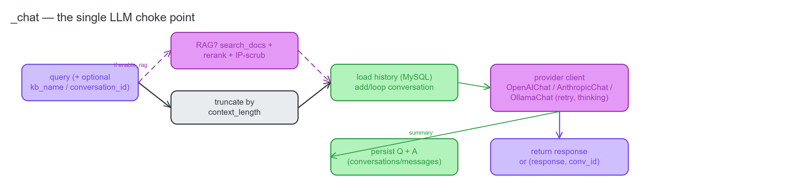
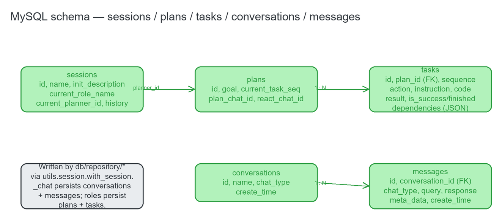
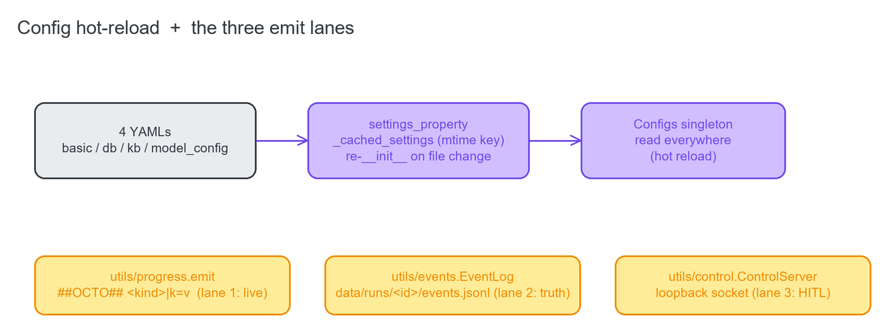

# 04 · LLM Choke Point, Persistence & Plumbing — `server/`, `db/`, `utils/`, `config/`

Everything the pipeline and the belief loop rest on: the single LLM entry point (`_chat`), the MySQL models
+ repositories, the shared plumbing (`utils/`), and the hot-reloading config layer.

---

## 4.1 `server/chat/chat.py` — the LLM choke point

**Source:** [`server/chat/chat.py`](../../server/chat/chat.py)

**Every model call in the whole system funnels through `_chat`.** It loads recent history from MySQL,
optionally augments the query with RAG context, dispatches to the configured provider client, persists the
query + response, and returns the text.

**`class OpenAIChat`** — The OpenAI-compatible client. `__init__(config)` sets up the endpoint; `chat(history)
-> str` calls the API with a tenacity retry on transient 429/5xx/timeout and returns the `**ERROR**` sentinel
on a non-retryable failure. Works with any OpenAI-compatible server (vLLM, LM Studio, OpenRouter, …).

**`class AnthropicChat`** — The native Anthropic/Claude client supporting **both** api_key and OAuth (Pro/Max)
auth plus extended thinking. `_split_history` (static) pulls the system message out into Anthropic's `system`
parameter; `_create(kwargs)` calls `messages.create` with a self-healing retry that drops `temperature` for
models that reject it; `chat(history)` maps the history, applies the effective thinking budget, retries
transient errors, **downgrades thinking on a 429** (a process-wide rate-limit avoidance), and concatenates
the text blocks. It version-gates the `thinking=` param and degrades gracefully on older SDKs.

**`class OllamaChat`** — The local Ollama client; `chat(history) -> str`.

**`_chat(query, kb_name=None, conversation_id=None, kb_query=None, summary=True)`** — **The single entry
point.** It optionally RAG-augments the query (when `enable_rag` and a `kb_name` are given — see
[`07-rag-experiment.md`](07-rag-experiment.md)), truncates by context length, loads or creates a conversation
(`add_conversation_to_db`), replays the recent messages (`get_conversation_messages`), dispatches to the
provider client selected by `Configs.llm_config.llm_model`, persists the Q + A (`add_message_to_db` when
`summary`), and returns `response` (if a `conversation_id` was given) or `(response, conversation_id)`. On any
failure it returns a `**ERROR**: …` string rather than raising, so callers degrade instead of crashing.

**Module helpers:** `_status_of(exc)`, `_notify_llm_wait` / `_notify_llm_ok` (emit the CLI `llm` wait
markers), `_is_retryable(exc)`, `_anthropic_has_thinking`, and `_thinking_rank` / `_effective_thinking` /
`_downgrade_thinking` (the process-wide adaptive-thinking logic that dodges rate limits).

## 4.2 `server/utils/utils.py`

**Source:** [`server/utils/utils.py`](../../server/utils/utils.py)

**`class BaseResponse` / `class ListResponse`** — API response envelopes for the FastAPI layer.
**`class LLMType(StrEnum)`** — `OPENAI` / `OLLAMA` / `ANTHROPIC`, the value that selects the provider client
in `_chat`. **`get_httpx_client(...)`** — a proxy-aware httpx client factory. **`api_address(is_public=False)
-> str`** — builds the API-server URL. **`replace_ip_with_targetip(input_string) -> str`** — masks every
dotted-quad IPv4 as the literal `<target>` before RAG context reaches the LLM (so retrieved docs don't leak
concrete addresses into the prompt).

> The FastAPI/WebUI server (`server/server.py`, `server/api/*`, `web/webui.py`) is launched separately by
> `cli.py start` / `startup.py` and hosts the RAG knowledge-base management surface — it is **not** part of
> the pentest run path.

---

## 4.3 `db/` — SQLAlchemy models + repositories (MySQL)

**Source:** [`db/models/`](../../db/models) · [`db/repository/`](../../db/repository)

The persistence is a small entity-relationship graph: a `session` owns `plan`s, a `plan` owns `task`s (with
dependencies), and every LLM call is a `message` under a `conversation`.

### Models

**`PlanModel(Base)` / `Plan(BaseModel)`** — the `plans` table + its pydantic mirror. `Plan` carries the
**task-graph logic**: `get_sorted_tasks() -> list[Task]` is the **Kahn topological sort** over integer task
dependencies (it raises `ValueError` on a cycle); the `current_task` property is the first unfinished task in
topo order (the deterministic pick); `ready_tasks` is the dependency-ready frontier (the belief policy's
candidate set); and `finished_tasks` / `finished_success_tasks` / `finished_fail_tasks` partition tasks for
replanning and summaries.

**`TaskModel(Base)` / `Task(BaseModel)`** — the `tasks` table (id, plan_id FK, sequence, action, instruction,
code JSON, result, is_success/is_finished, dependencies JSON) + its mirror (dependencies as an index list).

**`SessionModel(Base)` / `Session(BaseModel)`** — the `sessions` table (id, name, init_description,
current_role_name, current_planner_id, history_planner_ids). `parse_history_planner_ids` (a validator) splits
the comma-joined string into a list; `ArrayField` is a pydantic-core list shim.

**`Conversation(Base)`** — the `conversations` table (id, name, chat_type, create_time).
**`MessageModel(Base)` / `Message(BaseModel)`** — the `messages` table (id, conversation_id FK, chat_type,
query, response, meta_data, create_time) + its mirror (query ≤10k, response ≤8192).

### Repositories

Each is a thin CRUD function decorated with `with_session`. **`get_planner_by_id`** loads + validates a
`PlanModel` (used to resume plans / build summaries); **`add_plan_to_db`** assigns a uuid and inserts a new
plan; **`add_task_to_plan`** bulk-inserts tasks (result truncated to 8192); **`add_session_to_db`** inserts a
session (history ids joined with commas); **`fetch_all_sessions`** loads all sessions for the resume prompt;
**`add_conversation_to_db`** returns an existing id or creates a `Conversation` (called by `_chat`);
**`add_message_to_db`** inserts a message; **`get_conversation_messages`** loads a conversation's messages in
time order for the LLM history replay.

---

## 4.4 `utils/` — shared plumbing + the three lanes

The config hot-reload and the three emit lanes that carry state out of the Python side.

### `utils/session.py` — engine + transactions

**Source:** [`utils/session.py`](../../utils/session.py)

Module globals `db_url`, `engine` (MySQL via pymysql), `SessionLocal`, and `Base` (the declarative base for
all models). `session_scope()` is a commit/rollback/close contextmanager; `with_session(f)` is the decorator
that injects a scoped session as the first arg (used by every repository function); `create_tables()` is the
idempotent schema creation (`CREATE TABLE IF NOT EXISTS`).

### `utils/log_common.py` — logging + role types

**Source:** [`utils/log_common.py`](../../utils/log_common.py)

**`class RoleType(Enum)`** = `COLLECTOR="Collection"`, `SCANNER="Scanning"`, `EXPLOITER="Exploitation"` — the
values that key the role dispatch and hand-off chaining. `build_logger(log_file="Auto-Pentest")` returns a
cached loguru logger; `_filter_logs`, `LoggerNameFilter`, `get_timestamp_ms`, `get_log_file`,
`get_config_dict` are logging-config helpers for the API/WebUI servers.

### `utils/progress.py` — the `##OCTO##` marker stream (lane 1)

**Source:** [`utils/progress.py`](../../utils/progress.py)

**`emit(kind, **fields)`** writes a `##OCTO## <kind>|k=v|k=v` line to stdout (best-effort). This marker format
is what the octopus CLI parses for its live phase/step/task/belief/decision view. `_clean(v)` makes marker
values single-line and delimiter-safe.

### `utils/events.py` — the R4 event log (lane 2, source of truth)

**Source:** [`utils/events.py`](../../utils/events.py)

**`class EventLog(run_id, root=None)`** is the append-only JSONL event log per run at
`data/runs/<id>/events.jsonl` — the LogView's source of truth. `append(type, **fields) -> record` writes one
JSON record (and mirrors a compact `event` marker) and never raises; `write_manifest(belief_dir, steps,
extra) -> manifest` writes `manifest.json` linking the events ↔ the belief trace; `read_all() -> list[record]`
reads all records (skipping a torn trailing line). `EVENT_TYPES` is the tagged-union of record types
(run_start / action_selected / observation / llm_likelihoods / belief_update / score / decision / approval_* /
error / run_end …).

### `utils/control.py` — the loopback control socket (lane 3, HITL)

**Source:** [`utils/control.py`](../../utils/control.py)

**`class _FramedConn`** is newline-delimited JSON framing over a socket (`send`/`recv`/`close`).
**`class ControlServer`** is the agent-side endpoint: it binds an ephemeral loopback port, announces it via
`emit("control", port=…)`, and accepts ONE CLI client (`wait_for_client`, `connected`, `send`, `recv`,
`close`). **`class ControlClient`** is a test/utility client mirror. `CONTROL_CMDS`
(`approve/deny/pause/resume/step/quit`) and `CONTROL_EVENTS` (`approval_request/paused/resumed`) are the
vocabularies.

---

## 4.5 `config/` — settings + hot reload

### `config/config.py`

**Source:** [`config/config.py`](../../config/config.py)

`PENTEST_ROOT` is the resolved project root. `class Mode(StrEnum)` (`Auto`/`Manual`/`SemiAuto`) drives
`ExecuteTask.run`. The four settings classes each back one YAML: **`BasicConfig`** (`basic_config.yaml` —
`log_verbose`, `enable_rag`, `mode`, the `kali` SSH dict, api/webui server dicts, paths; `make_dirs()`),
**`DBConfig`** (`db_config.yaml` — the `mysql` connection dict), **`KBConfig`** (`kb_config.yaml` — Milvus/RAG
params), and **`LLMConfig`** (`model_config.yaml` — `api_key`/`base_url`/`llm_model`/`llm_model_name`/
`auth_mode`/`auth_token`/`max_tokens`/`thinking_level`/temperature/history_len/context_length/timeout — read
by `_chat` and the provider clients; **this is where the LLM is swapped**). `class ConfigsContainer` aggregates
the four via `settings_property` and exposes `create_all_templates()` / `set_auto_reload(flag)`; the module
exports the global singleton `Configs = ConfigsContainer()`.

### `config/pydantic_settings_file.py` — hot-reload machinery

**Source:** [`config/pydantic_settings_file.py`](../../config/pydantic_settings_file.py)

**`class BaseFileSettings(BaseSettings)`** is the YAML-backed settings base (adds a
`YamlConfigSettingsSource`, exposes an `auto_reload` property). **`class YamlTemplate`** generates commented
YAML config templates from a pydantic model. `settings_property(settings)` returns a property that hands back
the cached, auto-reloaded settings; `_lazy_load_key(settings)` builds a cache key from the config files' mtimes;
`_cached_settings(settings)` is the mtime-keyed cache that re-`__init__`s the settings when a file changes —
**that is the hot reload**. Supporting: `MyBaseModel`, `SubModelComment`, `import_yaml`.

---

## 4.6 Entry points (top level)

**Source:** [`pentest.py`](../../pentest.py) · [`cli.py`](../../cli.py) · [`startup.py`](../../startup.py)

**`pentest.py`** — `main(...)` is the `vulnbot` CLI command (flags `-m`, `--description` (headless),
`--no-resume`, `--session-name`, `--init-db`, `--agent`, `--step`); `run_belief_agent(console, session,
max_steps, step_mode=False)` is the `--agent` path (wires the R3 executor + belief LLM + EventLog +
BeliefStore + ControlServer, then runs `BeliefAgent.run`); plus `initialize_session` / `preload_session` /
`save_session`, `db_reachable` / `_mysql_dsn`, and `_extract_target(text)` (the first IPv4/hostname in the
description → the belief target).

**`cli.py`** — `main()` (a click group) + `init()` (`cli.py init` — make dirs, `create_tables`, write config
templates); it registers `start`→`startup.main`, `vulnbot`→`pentest.main`, and the `pentestgpt`/`base`
baselines.

**`startup.py`** — `main(all, api, webui)` (`cli.py start` — launch the FastAPI API + Streamlit WebUI, the
RAG stack, separate from the pentest run) + `run_api_server`, `run_webui`, `start_main_server`,
`_set_app_event`.

> **Import gotcha:** `cli.py` eagerly imports the FastAPI/RAG/langchain stack, so a pentest is run directly
> via `pentest.py` (not `cli.py vulnbot`) — that keeps a run free of the heavy RAG imports when
> `enable_rag: false`.
