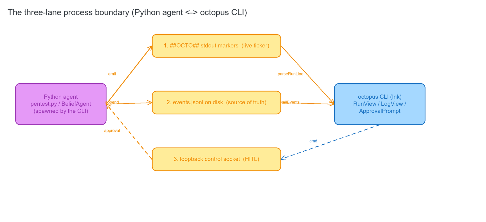
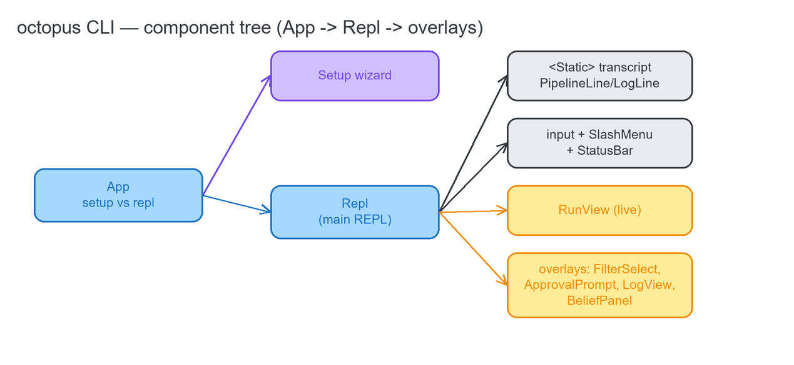
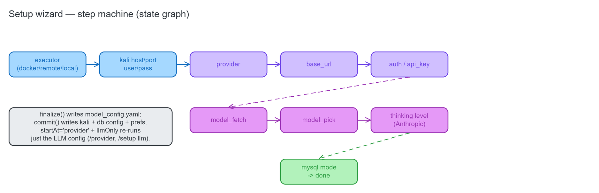

# 05 · The octopus CLI (Ink / TypeScript) — `cli/src`

An Ink (React-in-the-terminal) front-end for the Python Octopus pipeline. Pure logic modules (`.ts`) are
unit-tested by `selftest.ts`; `.tsx` are Ink components. The CLI spawns `python pentest.py …` and talks to
the agent across **three independent lanes**.

## 5.1 The three-lane process boundary

**Source:** [`cli/src/run.ts`](../../cli/src/run.ts) · [`cli/src/control.ts`](../../cli/src/control.ts) · [`cli/src/logview.ts`](../../cli/src/logview.ts)

1. **`##OCTO##` stdout markers** — machine-readable progress lines on the pipeline's merged stdout/stderr,
   folded into a `RunState` by `run.ts::parseRunLine` and rendered by `RunView.tsx`. Non-marker lines become
   styled scrollback via `logfmt.ts` + `PipelineLine.tsx`.
2. **Loopback control socket (R2 HITL)** — the agent opens a `ControlServer` on `127.0.0.1:<ephemeral>` and
   announces it via a `##OCTO## control|port=N` marker; the Repl detects it with `control.ts::parseControlPort`
   and connects a `ControlClient` (newline-JSON both ways) for approve/deny/pause/resume/step/quit.
3. **`events.jsonl` tail (R4)** — the on-disk source of truth at `data/runs/<id>/events.jsonl`, tailed +
   parsed by `logview.ts` and rendered by `LogView.tsx`.

**Launch:** `octopus` (bash) / `octopus.ps1` (PowerShell) at the repo root — install deps on first run, then
`npm start`.

## 5.2 The component tree

**Source:** [`cli/src/App.tsx`](../../cli/src/App.tsx) · [`cli/src/ui/Repl.tsx`](../../cli/src/ui/Repl.tsx)

`index.tsx` renders `App`, which picks the Setup wizard vs the Repl. The Repl owns the append-only `<Static>`
transcript, the input line, the slash menu, and all overlays (pickers, the approval prompt, the LogView).

---

## Core logic (`.ts`)

### `cli/src/run.ts` — the `##OCTO##` marker reducer (lane 1)
**Source:** [`cli/src/run.ts`](../../cli/src/run.ts)

`parseRunLine(state, line, now)` folds one stdout line into a new `RunState` (a switch over marker kinds
phase/plan/task/belief/decision/llm/step/phase_done/error); `isMarker(line)` tests the `##OCTO##` prefix;
`emptyRunState(now)` is the initial state; `cleanErrorText(s)` compresses 429/error blobs; `warningFrom(line)`
extracts a soft failure; `fmtDuration(ms)` and `summarizeRun(state, code, now)` format the header + post-run
summary. Types: `RunState`, `RunPhase`, `RunTask`, `RunStepEntry`, `BeliefUpdate`, `LlmWait`, `RunStep`.

### `cli/src/logfmt.ts` — pipeline-log formatter
**Source:** [`cli/src/logfmt.ts`](../../cli/src/logfmt.ts)

`parseLoguru(line)` splits a loguru row (`TS | LEVEL | where - msg`); `classifyLog(line)` classifies a line
into a `LogKind` (command / instruction / summary / plan-json / divider / error / warn / info / cont / debug,
or null to drop), detecting `<execute>` blocks, result banners, and `next_task:` / `summary:` labels. Types:
`Loguru`, `LogKind`, `ClassifiedLog`.

### `cli/src/executor.ts` — lab orchestration + spawning the pipeline
**Source:** [`cli/src/executor.ts`](../../cli/src/executor.ts)

`runPentest(description, maxSteps, onLine, onExit, agent=false) -> PentestRun` spawns `python pentest.py -m N
--no-resume --description <desc> [--agent]` and streams stdout line-by-line (`stop()` sends SIGINT;
`agent=true` selects the R1 belief loop). `ensureDb(mysqlMode, onLine)` + `ensureKali(onLine)` are the `/run`
preflights; `labUp` / `labDown` / `labStatus` / `smoke` drive the Docker compose lab; `dockerAvailable`,
`dbReachable`, `mysqlUp`, `waitForDb`, `initDb` support them.

### `cli/src/control.ts` — the HITL control-socket client (lane 3)
**Source:** [`cli/src/control.ts`](../../cli/src/control.ts)

`parseControlPort(line)` reads the port from a `control|port=N` marker; `class ControlClient` is the
one-per-run TCP client — `connect`, `send(cmd, extra)`, the `approve/deny/pause/resume/step/quit` helpers,
`close`, a `connected` flag, and a newline-JSON parser that invokes `onEvent/onClose/onError/onConnect`.
Best-effort — a missing socket never blocks a run. Types: `ControlCmd`, `ControlEvent`, `ControlClientOpts`.

### `cli/src/logview.ts` — the R4 event-log data layer (lane 2)
**Source:** [`cli/src/logview.ts`](../../cli/src/logview.ts)

`parseEventLine(line)` / `parseEvents(text)` are the pure parse (skip blank/torn/type-less);
`filterEvents(events, types?)` filters by type; `summarizeEvent(r)` maps a record → `{icon, color, text}` per
type (the render mapping, unit-tested); `runsDir()` / `eventsPathFor(runId)` / `latestRunId()` /
`readEvents(runId)` resolve the run logs; `tailEvents(runId, onRecord, {pollMs}) -> Tail` streams appended
records (fs.watch + poll fallback, de-duped by byte offset, truncation-safe). Types: `EventRecord`, `Tail`.

### `cli/src/config.ts` — config bridge (writes the project YAMLs)
**Source:** [`cli/src/config.ts`](../../cli/src/config.ts)

`REPO_ROOT`; `loadPrefs`/`savePrefs`/`isFirstRun` (`cli/.octopus.json`); `writeModelConfig(m)` +
`getModel`/`getProviderId`/`getAuthMode`/`getModelConfig`; `setModel(name)` (`/model`); `setProvider(id)`
(`/provider` — wipes stale secrets on a real change); `setThinkingLevel`; `setAuthToken`; `listProviders`;
`writeKaliConfig`/`getKali` (`basic_config.yaml` Kali); `writeDbConfig`/`getDbConfig`/`DEFAULT_DB`
(`db_config.yaml`). Types: `ExecutorMode`, `MysqlMode`, `OctopusPrefs`, `ModelSettings`, `KaliSettings`,
`DbSettings`.

### `cli/src/providers.ts` — the LLM provider registry (endpoints only)
**Source:** [`cli/src/providers.ts`](../../cli/src/providers.ts)

`PROVIDERS` (openai, anthropic native, anthropic-compat, qwen, kimi, deepseek, openrouter, ollama,
openai-compatible); `THINKING_LEVELS` (Anthropic thinking budgets); `firstLlmStep` / `stepAfterBaseUrl`
(wizard routing); `getProvider` / `listProviders`; `modelsUrlFor(p, baseUrl?)`. Types: `ProviderKind`,
`AuthMode`, `Provider`, `ThinkingLevel`, `LlmStep`.

### `cli/src/models.ts` — live model-catalog fetch
**Source:** [`cli/src/models.ts`](../../cli/src/models.ts)

`fetchModels(p, opts)` GETs the provider's `/models`, parses OpenAI/Ollama/array shapes into a sorted
de-duped id list, and returns `[]` on any error/offline (never throws). Interface `FetchModelsOpts`.

### `cli/src/oauth.ts` — Claude Pro/Max OAuth (PKCE, manual paste)
**Source:** [`cli/src/oauth.ts`](../../cli/src/oauth.ts)

`beginLogin()`, `buildAuthUrl`, `splitPastedCode`, `completeLogin(...)`, `exchangeCode` / `refresh`,
`getValidToken(opts)`, `saveAuth` / `loadAuth` / `isExpired`, `makePkce` / `randomState`, `openBrowser(url)`,
`AUTH_FILE`. Types: `AuthTokens`, `AuthUrl`, `ExchangeOpts`.

### `cli/src/belief.ts` — belief-trace viewer
**Source:** [`cli/src/belief.ts`](../../cli/src/belief.ts)

`listRuns()`, `loadLatest(runId)`, `formatBelief(runId?)` (printable lines of the latest belief — used by
`/belief`), `beliefView(runId?)` (structured for the bar panel). Types: `Factor`, `BeliefView`.

### `cli/src/commands.ts` — the slash-command handler + registry
**Source:** [`cli/src/commands.ts`](../../cli/src/commands.ts)

`COMMANDS` (help/setup/provider/model/login/status/lab/belief/log/run/clear/quit — powers `/help` + the slash
menu); `handleCommand(input) -> CommandResult` (async dispatch: `/run` bare-IP → task sentence, `/log`,
`/model`, `/provider`, `/status`, `/lab up|down|smoke`, `/belief`, `/login`); `commandMeta(input)` (slow? +
verb label); `fetchingLabel()`. Types: `CommandSpec`, `CommandResult` (actions quit/setup/clear/pick-model/
reconfigure-llm/login/run-pentest/log).

### `cli/src/selftest.ts` — headless self-test
**Source:** [`cli/src/selftest.ts`](../../cli/src/selftest.ts)

An assertion script (no exports) exercising config read/write, `/model` + `/provider`, the provider registry,
model fetch (mocked), OAuth PKCE/exchange, the `run.ts` marker reducer, `logfmt` classify, the control socket
(loopback round-trip), and logview parse/filter/tail/summarize. Prints `SELFTEST PASS`.

---

## UI components (`.tsx`, `cli/src/ui`)

**Source:** [`cli/src/ui/`](../../cli/src/ui)

- **`Repl.tsx`** — `default Repl({onSetup, autoLogin, version})`, the main REPL. Owns the `<Static>`
  transcript, the input line + caret, history, the slash menu, and all overlays. Orchestrates: model/thinking
  pickers, OAuth login, spawning runs (`startRun` → `ensureDb`/`ensureKali`/`runPentest`), the `feed()` stdout
  sink (marker → `parseRunLine` → RunView; non-marker → `classifyLog` → scrollback; `parseControlPort` →
  `connectControl`), the R2 control socket (`connectControl`/`decideApproval`/`closeControl`, the approval
  overlay + `p/r/s/q` keybinds while running), and the R4 `LogView` overlay (`/log`). Ctrl+C stops a run then
  exits.
- **`RunView.tsx`** — `default RunView({state, paused, awaiting})`, the live run view: animated header
  (verb · phase x/y · ↓lines), phase tree + per-phase timers + task/step checklist, `awaiting`-approval +
  `paused` banners, the `llmWait` retry indicator, belief bars, decision line, warnings, log-tail ticker.
- **`ApprovalPrompt.tsx`** — `default ApprovalPrompt({req, onDecide})`, the R2 approve/deny overlay (defaults
  to DENY; `a`/`d`/arrows/enter/esc). `ApprovalRequest` interface.
- **`LogView.tsx`** — `default LogView({runId, onClose})`, the R4 event-log viewer (never raw JSON):
  live-tails `events.jsonl`, renders each record per type (belief bars, observation summaries, compact
  lines); `↑/↓`/`j/k` scroll, Enter expand, `f` cycle filter, `g/G` top/bottom, `q`/Esc close.
- **`BeliefPanel.tsx`** — `bar(p, width?)` (a 12-cell probability bar, reused by RunView/LogView), `color(p)`
  (probability → color), `default BeliefPanel({runId})` (render the latest belief as bars).
- **`Banner.tsx`** — the ASCII octopus art + title. **`StatusBar.tsx`** — the bottom status bar (executor ·
  model · hint). **`SlashMenu.tsx`** — `matchCommands(input)` + the autocomplete menu. **`Spinner.tsx`** — a
  braille spinner + verb + elapsed. **`inputs.tsx`** — `TextField`, `FilterSelect` (type-to-filter select),
  `Select<T>`. **`PipelineLine.tsx`** / **`LogLine.tsx`** — render one classified pipeline log / plain
  transcript line as a styled element.

## 5.3 The setup wizard (state machine)

**Source:** [`cli/src/ui/Setup.tsx`](../../cli/src/ui/Setup.tsx)

**`default Setup({onDone, startAt, llmOnly})`** — the first-run / reconfig wizard. It walks the step machine
executor → kali(host/port/user/pass) → provider → base_url → auth → api_key → model_fetch → model_pick →
thinking → mysql. `finalize()` writes `model_config.yaml`; `commit()` writes the kali + db config + prefs;
`startAt='provider'` + `llmOnly` re-runs just the LLM sub-flow (used by `/provider`, `/setup llm`).

> Verify the CLI with `npm --prefix cli run typecheck` + `npm --prefix cli run selftest`.
