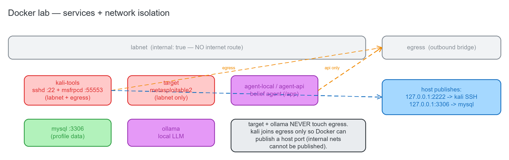
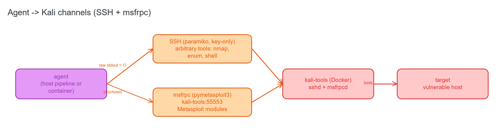

# 06 · The Dockerized Lab

**Source:** [`docker-compose.yml`](../../docker-compose.yml) · [`docker/`](../../docker) · [`lab.ps1`](../../lab.ps1) · [`Makefile`](../../Makefile) · full write-up [`../INFRA.md`](../INFRA.md)

An **isolated** range that gives the agent a tool host and a victim without touching the internet.

## 6.1 Services + network isolation



| Service | Image / build | Network(s) | Profile | Purpose |
|---------|---------------|------------|---------|---------|
| `kali-tools` | build `./docker/kali` | labnet + egress | default | Kali tool host: `sshd` (:22) + `msfrpcd -S -p 55553`. Publishes SSH at `127.0.0.1:2222`. `NET_ADMIN`/`NET_RAW` for raw nmap. On egress only so Docker can publish a host port (internal nets can't be published). |
| `target` | `tleemcjr/metasploitable2` | labnet only | default | The deliberately vulnerable victim; **no internet route by design**. |
| `mysql` | `mysql:8` | labnet + `127.0.0.1:3306` | `data` | sessions/plans/tasks/conversations/messages store; opt-in. |
| `ollama` | `ollama/ollama` | labnet only | `local` | Local LLM, no egress (GPU passthrough stanza commented). |
| `agent-local` | build `./docker/agent` | labnet only | `local` | The belief agent, local-model variant — strictly **no egress**. |
| `agent-api` | same build | labnet + egress | `api` | Same agent, hosted-LLM variant — the ONLY service with egress. |

Both agent variants share `container_name: agent`, mount the repo at `/app` and the SSH private key
`docker/agent/keys/agent_ed25519` → `/root/.ssh/id_ed25519:ro`, and idle on `sleep infinity`.

**Network split.** **`labnet`** is an internal bridge (`internal: true`, **no route to the internet**)
carrying kali + target + agent — the attack path is isolated by construction. **`egress`** is a normal
outbound bridge, joined **only** by `kali-tools` (so Docker can publish its host port) and `agent-api`
(hosted LLM). `target` and `ollama` never touch egress.

## 6.2 Agent → Kali channels

**Source:** [`docker/agent/smoke_channels.py`](../../docker/agent/smoke_channels.py)



Two transports, both on labnet:

- **SSH** (paramiko, key-based only) → arbitrary tools (nmap, enumeration, shell). Raw stdout is the
  observation `O` fed to the Belief Updater.
- **msfrpc** (`pymetasploit3.MsfRpcClient` → `kali-tools:55553`, `MSF_RPC_PASSWORD`) → Metasploit exploit
  modules over RPC (cleaner + more robust than screen-scraping msfconsole).

This is the same SSH/msfrpc split the R3 executor's channels ([`02-executor.md`](02-executor.md)) drive.

## 6.3 Supporting files

| File | Purpose |
|------|---------|
| [`docker/kali/Dockerfile`](../../docker/kali/Dockerfile) | kali-rolling + `kali-linux-headless` + openssh-server; SSH is **key-only** (`PasswordAuthentication no`, `PermitRootLogin prohibit-password`); `EXPOSE 22 55553`; pins the apt mirror via `KALI_MIRROR_HOST`. |
| [`docker/kali/entrypoint.sh`](../../docker/kali/entrypoint.sh) | Install `AGENT_SSH_PUBKEY` into authorized_keys → start `sshd` → `msfrpcd -P $MSF_RPC_PASSWORD -S -a 0.0.0.0 -p 55553` → `tail -f /dev/null`. |
| [`docker/agent/Dockerfile`](../../docker/agent/Dockerfile) | `python:3.11-slim` + git/openssh-client; installs `requirements.txt` then `pymetasploit3 paramiko`. |
| `docker/agent/keys/agent_ed25519{,.pub}` | The agent's SSH keypair (git-ignored; pubkey pasted into `.env` as `AGENT_SSH_PUBKEY`). |
| [`Makefile`](../../Makefile) / [`lab.ps1`](../../lab.ps1) | Mirrored lifecycle wrappers: `up`, `dev-up`, `down`, `build`, `config`, `shell-kali`, `shell-agent`, `logs`, `smoke`; `PROFILE` / `-Backend` = `local\|api`. Makefile is canonical (Linux/CI/in-agent); `lab.ps1` is the Windows-host equivalent. |
| [`.env.example`](../../.env.example) | Template for secrets: `PENTEST_ROOT`, optional proxies, MySQL creds, `MSF_RPC_PASSWORD`, `AGENT_SSH_PUBKEY`, the LLM backend selector. |

## 6.4 How it connects to VulnBot

The lab is the **execution substrate**. The host-side pipeline (octopus spawns Python on the host) reaches
kali over `127.0.0.1:2222` (SSH) and MySQL over `127.0.0.1:3306`; a containerized agent reaches services by
hostname (`kali-tools:55553`, `mysql:3306`, `ollama`). The compose stack contains **no VulnBot application
logic** — it only provides the tool host + target that the actions drive and the MySQL store backing the
session/plan/task tables.

```powershell
cp .env.example .env      # fill MSF_RPC_PASSWORD, AGENT_SSH_PUBKEY, LLM backend
./lab.ps1 dev-up          # kali-tools + target + agent (Windows; or `make dev-up`)
./lab.ps1 smoke           # verify agent->kali channels (SSH nmap + msfrpc modules)
./lab.ps1 down
```
