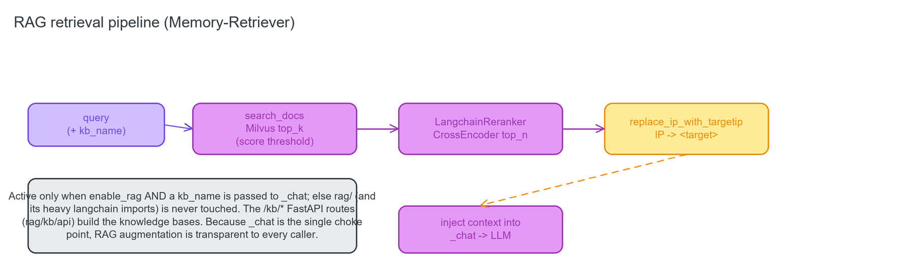
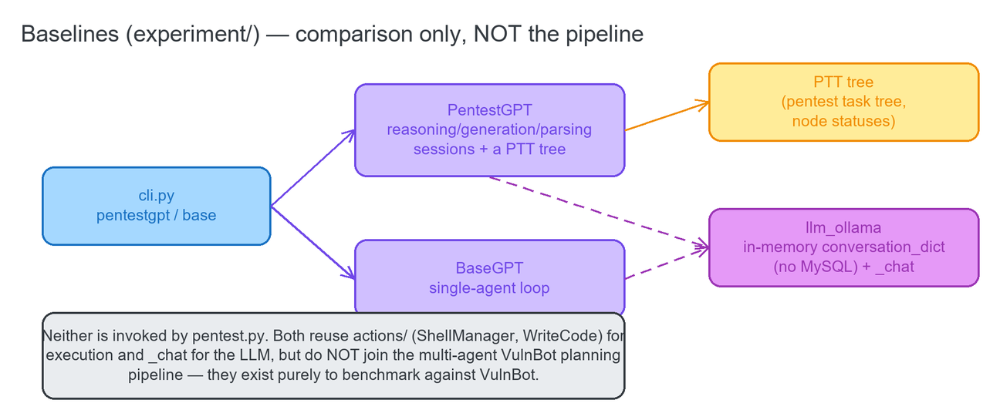

# 07 · RAG / Memory-Retriever (`rag/`) & Baselines (`experiment/`)

## 7.1 `rag/` — the Memory-Retriever / RAG stack

**Source:** [`rag/`](../../rag) · integration site [`server/chat/chat.py`](../../server/chat/chat.py)

Adapted from Langchain-Chatchat. It stores penetration-test reference material (write-ups, PoCs) as
embeddings in a **Milvus** vector store, retrieves the top-k relevant docs for a query, reranks them with a
CrossEncoder, scrubs concrete IPs to the literal `<target>`, and injects the result into the single LLM
choke point.



It is **active only when** `Configs.basic_config.enable_rag` is true **and** a `kb_name` is passed to
`_chat`; otherwise the whole package (and its heavy langchain imports) is never touched — imports are
deferred inside the RAG branch of `_chat`.

### Module tree

```
rag/
├─ embedding/embedding.py       get_embeddings(embed_model) -> Embeddings (openai/ollama/HuggingFace by config)
├─ reranker/reranker.py         LangchainReranker (CrossEncoder); compress_documents(documents, query) -> reranked top_n
├─ retriever/
│  ├─ base.py                   BaseRetrieverService ABC (from_vectorstore / get_relevant_documents)
│  └─ milvus_vectorstore.py     MilvusRetriever + MilvusVectorstoreRetrieverService (similarity / score-threshold)
├─ parsers/                     file -> text loaders (RapidOCR-backed) for ingestion
│  ├─ __init__.py               re-exports the loaders
│  ├─ csv_parser.py             FilteredCSVLoader
│  ├─ docx_parser.py            RapidOCRDocLoader
│  ├─ img_parser.py             RapidOCRLoader
│  ├─ pdf_parser.py             RapidOCRPDFLoader
│  ├─ ppt_parser.py             RapidOCRPPTLoader
│  └─ ocr.py                    get_ocr() RapidOCR factory
└─ kb/                          knowledge-base management
   ├─ base.py                   KBService ABC + KBServiceFactory + SupportedVSType(MILVUS); get_kb_file_details
   ├─ service/milvus_kb_service.py   MilvusKBService (create/add/delete/search docs)
   ├─ api/
   │  ├─ kb_api.py              list_kbs / create_kb / delete_kb (KB lifecycle)
   │  └─ kb_doc_api.py          search_docs, upload/list/delete-doc handlers  <- primary retrieval entry point
   ├─ repository/               SQLAlchemy CRUD for KB + file/doc metadata
   │  ├─ kb_repository.py
   │  └─ knowledge_file_repository.py
   ├─ models/                   ORM + pydantic schemas
   │  ├─ kb_document_model.py       MatchDocument, KnowledgeBaseSchema
   │  └─ knowledge_file_model.py
   └─ utils/kb_utils.py         validate_kb_name (../ path-attack guard), KnowledgeFile, get_kb_path,
                                files2docs_in_thread, splitter helpers
```

### Public API the rest of VulnBot calls

- **`rag.kb.api.kb_doc_api.search_docs(query, knowledge_base_name, top_k, score_threshold, …)`** — the
  retrieval function. Called by `server/chat/chat.py::_chat` (via `run_in_threadpool`) and exposed as
  `POST /kb/search_docs`.
- **`rag.reranker.reranker.LangchainReranker(top_n, name_or_path=Configs.llm_config.rerank_model).compress_documents(documents, query)`**
  — called in `_chat` right after `search_docs`.
- **`rag.kb.api.kb_api.{list_kbs, create_kb, delete_kb}`** + the doc upload/list/delete handlers — the `/kb/*`
  management router (`server/api/kb_route.py`).
- **`rag.kb.base.KBServiceFactory`** / **`SupportedVSType`** — the factory every api handler uses to get a
  `MilvusKBService`.

### How it connects

The one integration site is `_chat`: when `enable_rag and kb_name is not None`, it runs `search_docs` →
`LangchainReranker.compress_documents` → joins the doc contents into `context`, then
`replace_ip_with_targetip(context)` (masks every dotted-quad IP as `<target>`), and appends that context to
the query before it reaches the LLM. Because `_chat` is the **single** LLM choke point, RAG augmentation is
transparent to every caller in the pipeline. The `/kb/*` FastAPI routes are the management surface for
building the knowledge bases (launched by `cli.py start` / `startup.py`).

---

## 7.2 `experiment/` — baselines (comparison only, NOT the VulnBot pipeline)

**Source:** [`experiment/`](../../experiment)

Self-contained reimplementations of two competing pentest agents, used only to **benchmark** against
VulnBot. Neither is invoked by `pentest.py`/`startup.py` — they are separate `cli.py` subcommands. Both use
their own **in-memory** conversation store (`llm_ollama.py`) rather than the VulnBot MySQL session layer.



| File | Purpose |
|------|---------|
| [`experiment/__init__.py`](../../experiment/__init__.py) | Empty package marker. |
| [`experiment/llm_ollama.py`](../../experiment/llm_ollama.py) | `OLLAMAPI` + `OPENAI` clients; an in-memory `conversation_dict {id: Conversation}`; `send_new_message`/`send_message` (no DB). |
| [`experiment/base.py`](../../experiment/base.py) | `BaseGPT` — the single-agent baseline loop; `main()` builds `BaseGPT(15, ollama)`. |
| [`experiment/pentestgpt.py`](../../experiment/pentestgpt.py) | `PentestGPT` — a PentestGPT-style baseline (reasoning/generation/parsing sessions, a PTT tree); `main()` builds `PentestGPT(15, ollama)`. |
| [`experiment/pentestgpt_prompt.py`](../../experiment/pentestgpt_prompt.py) | `PentestGPTPrompt` — the PTT / session-init prompt strings. |
| [`experiment/prompt_select.py`](../../experiment/prompt_select.py) | `prompt_ask` / an interactive radio-list TUI (prompt_toolkit). |
| [`experiment/execute.py`](../../experiment/execute.py) | `Execute` — parse `<execute>…</execute>` shell blocks; run via `actions.run_code`/`ShellManager`. |
| [`experiment/extract_code.py`](../../experiment/extract_code.py) | `ExtractCode` — turn a "next task" into shell commands; calls `server.chat.chat._chat` (the shared LLM choke point). |

**Entry points** (registered in `cli.py`): `cli.py pentestgpt` → `PentestGPT(15, ollama).main()`; `cli.py
base` → `BaseGPT(15, ollama).main()`. Both reuse VulnBot's `actions/` for execution and `_chat` for the LLM,
but do **not** participate in the multi-agent VulnBot planning/reasoning pipeline — they exist purely for
comparison.
