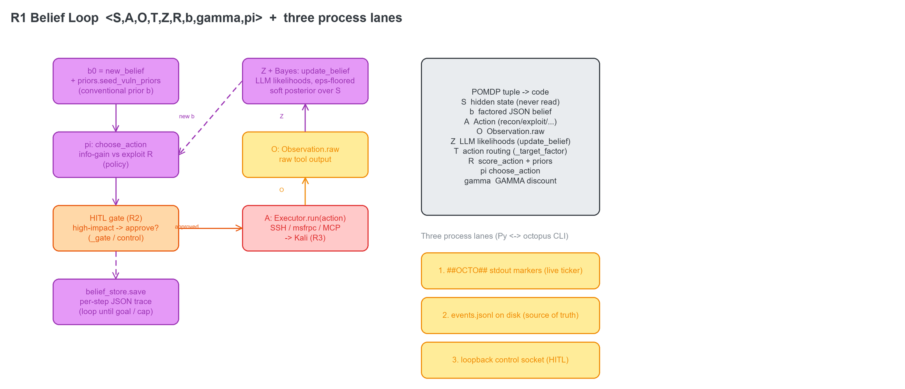

# VulnBot — Reference Documentation

A complete, from-scratch reference for the **VulnBot** platform (this thesis fork): what it is, how a
run flows step-by-step, and **every module, agent, and function** described. Built for a reader who has
never seen the codebase.

VulnBot (arXiv 2501.13411) is a **multi-agent LLM autonomous penetration-testing framework**. This fork
adds an explicit **POMDP belief-state** and hardens the agent into a fully interactive system across four
cross-cutting requirements **R1–R4** (full POMDP loop, interactive HITL CLI, multi-channel executor, JSON
event logging + a rich log viewer). All of R1–R4 is implemented; 71 pytest + the CLI selftest are green.

---

## How to read this

| File | Covers |
|------|--------|
| [`00-overview.md`](00-overview.md) | What VulnBot is, the thesis-fork goal, the end-to-end run lifecycle **step-by-step**, and a glossary. |
| [`01-belief-pomdp.md`](01-belief-pomdp.md) | The POMDP belief layer — `pomdp/` (belief state, updater, policy, reward, store, the standalone `BeliefAgent` loop). Every function. |
| [`02-executor.md`](02-executor.md) | The R3 multi-channel executor — `executor/` (facade, router, SSH/msfrpc/MCP channels, timeout/retry/fallback, the `Observation` schema). Every function. |
| [`03-roles-pipeline.md`](03-roles-pipeline.md) | The legacy 3-phase pipeline agents — `roles/` (Collector→Scanner→Exploiter), `actions/` (Planner, Generator, Executor, Summarizer, shells), `prompts/`. Every function. |
| [`04-llm-persistence.md`](04-llm-persistence.md) | The LLM choke point + persistence + plumbing — `server/` (`_chat`, provider clients), `db/` (models + repositories), `utils/`, `config/`. Every function. |
| [`05-cli-frontend.md`](05-cli-frontend.md) | The octopus Ink/TypeScript CLI — all 27 `cli/src` modules + the three-lane process boundary. Every exported symbol. |
| [`06-lab-infra.md`](06-lab-infra.md) | The Dockerized lab — compose services, network isolation, agent→Kali channels, `lab.ps1`/`Makefile`. |
| [`07-rag-experiment.md`](07-rag-experiment.md) | The RAG / Memory-Retriever stack (`rag/`) and the baseline agents (`experiment/`). |

> This reference is generated from a full function-level inventory of the source. It complements the
> higher-level [`../ARCHITECTURE.md`](../ARCHITECTURE.md), the executor deep-dive
> [`../EXECUTOR.md`](../EXECUTOR.md), the POMDP mapping [`../POMDP_INTEGRATION.md`](../POMDP_INTEGRATION.md),
> and the lab write-up [`../INFRA.md`](../INFRA.md).

---

## The agent cast (one line each)

| Agent / module | Role |
|----------------|------|
| **Collector → Scanner → Exploiter** (`roles/`) | The three sequential **phase agents**: recon, vulnerability scan, exploitation. Each is a `Role` subclass that sets a goal + tools + prompts and chains to the next. |
| **Planner** (`actions/planner.py` + `write_plan.py`) | Builds and revises the **Penetration Task Graph (PTG)** — a dependency graph of tasks, topologically sorted. |
| **Generator** (`actions/write_code.py`) | Turns the next task into concrete `<execute>` shell commands. |
| **Executor** (`actions/execute_task.py` + `shell_manager.py`) | Runs those commands on Kali over one shared SSH session. |
| **Summarizer** (`actions/plan_summary.py`) | Condenses a finished phase into context for the next phase. |
| **LLM choke point** (`server/chat/chat.py::_chat`) | The single funnel every model call passes through (OpenAI / Anthropic / Ollama), with history persistence + optional RAG. |
| **Memory-Retriever / RAG** (`rag/`) | Retrieves + reranks reference docs from Milvus and injects them into `_chat`. |
| **Belief layer** (`pomdp/`) | The explicit POMDP: a factored belief `b`, a soft-Bayes **Updater**, a belief-conditioned **policy** π, a **reward** R + priors, and a per-step **Belief Store**. |
| **BeliefAgent** (`pomdp/agent.py`) | The R1 standalone belief-first control loop that ties π + executor + updater + store together. |
| **octopus CLI** (`cli/`) | The Ink/TypeScript front-end: setup wizard, live run view, human-in-the-loop approvals, and the event-log viewer. |

---

## Diagrams

Every subsystem/description in this reference embeds its own diagram. The four top-level views:

### Agent connection map — who talks to whom


### System architecture & data flow


### The R1 belief loop + the POMDP tuple + the three process lanes


### The R3 executor — facade, router, channels, Observation


### Full diagram index (23 total)

| Doc | Diagrams |
|-----|----------|
| README (this) | `agents`, `architecture`, `pomdp_loop`, `executor` |
| [`00-overview`](00-overview.md) | `architecture`, `00-lifecycle-pipeline`, `00-lifecycle-agent` |
| [`01-belief-pomdp`](01-belief-pomdp.md) | `pomdp_loop`, `01-belief-structure` (tree), `01-updater`, `01-policy-reward` |
| [`02-executor`](02-executor.md) | `executor`, `02-robustness`, `02-router` |
| [`03-roles-pipeline`](03-roles-pipeline.md) | `agents`, `03-role-loop`, `03-ptg` (DAG) |
| [`04-llm-persistence`](04-llm-persistence.md) | `04-chat`, `04-db-schema` (ER graph), `04-config-lanes` |
| [`05-cli-frontend`](05-cli-frontend.md) | `05-three-lanes`, `05-repl` (component tree), `05-setup` (state machine) |
| [`06-lab-infra`](06-lab-infra.md) | `06-compose` (service/network graph), `06-channels` |
| [`07-rag-experiment`](07-rag-experiment.md) | `07-rag`, `07-baselines` (PTT tree) |

Every **graph or tree** in the platform is drawn explicitly: the PTG dependency DAG (`03-ptg`), the factored
belief tree (`01-belief-structure`), the DB entity-relationship graph (`04-db-schema`), the CLI component
tree (`05-repl`), the setup state machine (`05-setup`), the compose service/network graph (`06-compose`),
the POMDP loop cycle (`pomdp_loop`), and the router/channel tree (`executor` / `02-router`).

> **Diagrams are generated deterministically** by [`diagrams/gen_ref_diagrams.py`](diagrams/gen_ref_diagrams.py)
> (emits editable `.excalidraw` source) and rasterized by [`../tools/render_png.py`](../tools/render_png.py).
> The `/excalidraw:excalidraw` MCP canvas needs a live browser and is unavailable in a headless run, so the
> deterministic pipeline is used instead — same embedded-PNG result. Regenerate all with:
> ```sh
> python docs/reference/diagrams/gen_ref_diagrams.py
> for f in docs/reference/diagrams/*.excalidraw; do \
>   python docs/tools/render_png.py "$f" "${f%.excalidraw}.png"; done
> ```

---

## Run it in one glance

```sh
# legacy 3-phase pipeline (Collector → Scanner → Exploiter)
python pentest.py -m 5 --description "authorized pentest of 10.0.0.5"

# R1 belief-first run (the standalone BeliefAgent POMDP loop)
python pentest.py --agent -m 20 --description "authorized pentest of 10.0.0.5"

# the octopus CLI front-end (setup wizard → REPL → /run [--agent] <target> → /log)
./octopus            # or ./octopus.ps1 on Windows
```

See [`00-overview.md`](00-overview.md) for the full step-by-step lifecycle of each.
